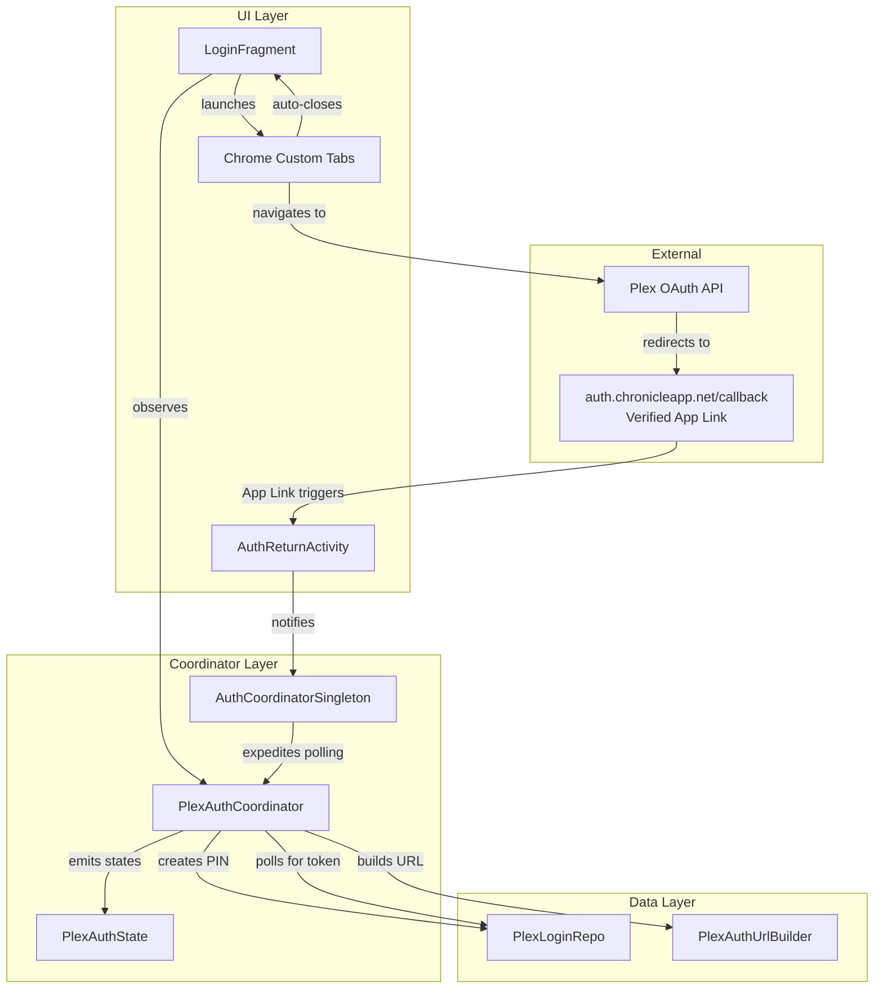
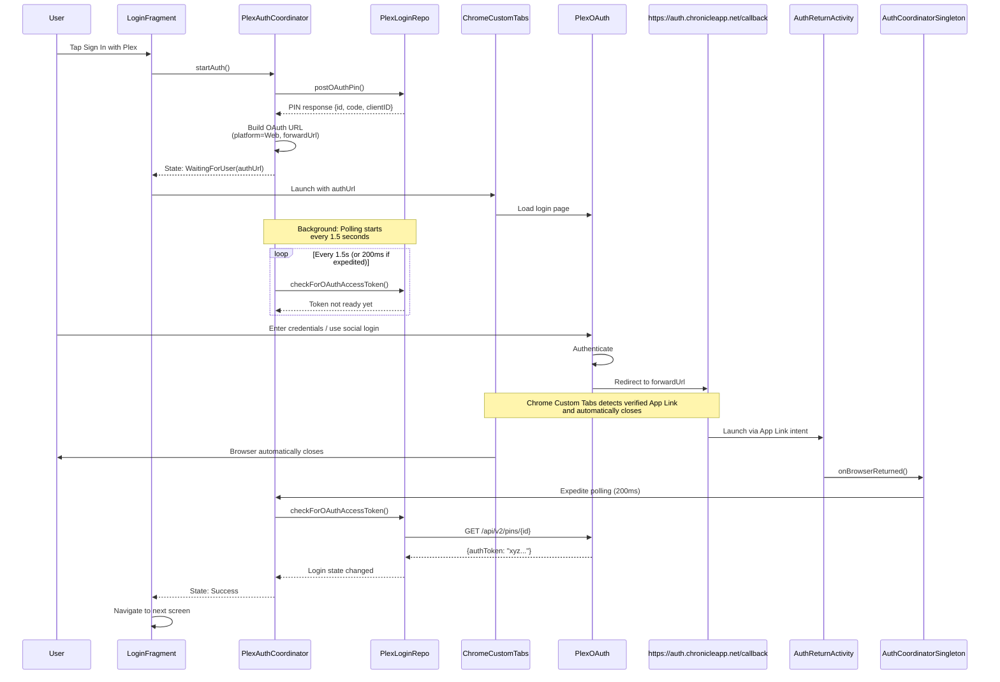

# Plex OAuth Login - Chrome Custom Tabs with Android App Links

## Overview

This document describes Chronicle's OAuth implementation using **Chrome Custom Tabs** with **Android App Links** for automatic browser dismissal. Chrome Custom Tabs automatically close when navigating to a verified App Link, providing a seamless OAuth experience without requiring JavaScript-based deep link triggers.

**Current Implementation**: HTTPS App Link (`https://auth.chronicleapp.net/callback`) with domain verification via Digital Asset Links.

**Legacy Fallback**: Custom URI scheme (`chronicle://auth/callback`) remains supported for edge cases where App Links may not work.

## Background

### Why Chrome Custom Tabs Over WebView?

Chrome Custom Tabs was chosen over an in-app WebView for several critical reasons:

| Aspect | Chrome Custom Tabs | WebView |
|--------|-------------------|---------|
| **Social Login Support** | ✅ Full support (Google, Facebook) | ❌ Blocked by providers |
| **Security** | ✅ User's browser security sandbox | ⚠️ App-controlled, less trusted |
| **Password Managers** | ✅ Native integration | ❌ Limited support |
| **User Trust** | ✅ Familiar browser UI | ⚠️ Users wary of in-app forms |
| **Auto-fill** | ✅ Full support | ⚠️ Limited support |
| **Maintenance** | ✅ Browser handles updates | ⚠️ App must handle security patches |
| **Auto-close on Redirect** | ✅ App Links auto-close | ⚠️ Manual dismissal required |

**Critical Issues Solved**:
1. Social login (Google, Facebook) is explicitly blocked in WebViews by identity providers for security reasons. By setting `platform=Web` and using Chrome Custom Tabs, Chronicle enables users to authenticate with their preferred method.
2. Chrome Custom Tabs remain in the foreground when redirecting to custom URI schemes (`chronicle://`). By using Android App Links (`https://auth.chronicleapp.net/callback`), the browser automatically closes when navigating to a verified domain owned by the app.

## Architecture

### Component Diagram



### Key Components

1. **[`PlexAuthCoordinator`](../app/src/main/java/local/oss/chronicle/features/auth/PlexAuthCoordinator.kt)** - State machine managing the OAuth flow
2. **[`PlexAuthUrlBuilder`](../app/src/main/java/local/oss/chronicle/features/auth/PlexAuthUrlBuilder.kt)** - Constructs OAuth URL with `forwardUrl` set to App Link
3. **[`PlexAuthState`](../app/src/main/java/local/oss/chronicle/features/auth/PlexAuthState.kt)** - Immutable state representation
4. **[`AuthReturnActivity`](../app/src/main/java/local/oss/chronicle/features/auth/AuthReturnActivity.kt)** - Handles App Link and legacy deep link callbacks
5. **[`AuthCoordinatorSingleton`](../app/src/main/java/local/oss/chronicle/features/auth/AuthCoordinatorSingleton.kt)** - Bridges Activity and Coordinator
6. **[`pages/.well-known/assetlinks.json`](../pages/.well-known/assetlinks.json)** - Digital Asset Links for domain verification
7. **[`pages/auth/callback/index.html`](../pages/auth/callback/index.html)** - Fallback page when App Links fail (rare)

## OAuth Flow Sequence



## Implementation Details

### 1. OAuth URL Construction

**Critical Parameter**: `platform=Web`

```kotlin
// From PlexAuthUrlBuilder.kt
private const val PLATFORM = "Web" // Must be "Web" for social login support

fun buildOAuthUrl(clientId: String, pinCode: String): String {
    val params = buildMap<String, String> {
        put("code", pinCode)
        put("clientID", clientId)
        put("forwardUrl", FORWARD_URL) // "https://auth.chronicleapp.net/callback"
        put("context[device][platform]", PLATFORM) // ← Critical!
        // ... other context params
    }
    // URL encoding...
}
```

**Why `platform=Web`?**
- Plex OAuth server treats platform=Android differently
- Android platform disables social login buttons
- Web platform enables Google, Facebook, etc.
- Chronicle uses Chrome Custom Tabs (native browser), so Web is accurate

### 2. Android App Links Flow

**AndroidManifest.xml** declares both the App Link (primary) and legacy deep link (fallback):

```xml
<activity
    android:name=".features.auth.AuthReturnActivity"
    android:exported="true"
    android:launchMode="singleTask">
    
    <!-- Primary: Android App Links (HTTPS with auto-verify) -->
    <intent-filter android:autoVerify="true">
        <action android:name="android.intent.action.VIEW" />
        <category android:name="android.intent.category.DEFAULT" />
        <category android:name="android.intent.category.BROWSABLE" />
        <data
            android:scheme="https"
            android:host="auth.chronicleapp.net"
            android:pathPrefix="/callback" />
    </intent-filter>
    
    <!-- Fallback: Custom URI scheme (legacy support) -->
    <intent-filter>
        <action android:name="android.intent.action.VIEW" />
        <category android:name="android.intent.category.DEFAULT" />
        <category android:name="android.intent.category.BROWSABLE" />
        <data
            android:scheme="chronicle"
            android:host="auth"
            android:pathPrefix="/callback" />
    </intent-filter>
</activity>
```

**Key Attribute**: `android:autoVerify="true"` triggers Android's Digital Asset Links verification. The system fetches `https://auth.chronicleapp.net/.well-known/assetlinks.json` at install time to verify domain ownership.

**Digital Asset Links File** (`pages/.well-known/assetlinks.json`):

```json
[
  {
    "relation": ["delegate_permission/common.handle_all_urls"],
    "target": {
      "namespace": "android_app",
      "package_name": "local.oss.chronicle",
      "sha256_cert_fingerprints": [
        "SHA256:..."
      ]
    }
  }
]
```

This file proves Chronicle owns the `auth.chronicleapp.net` domain. Without it, the App Link falls back to the legacy `chronicle://` scheme.

**Fallback Page** (`pages/auth/callback/index.html`):

```html
<!DOCTYPE html>
<html>
<head>
    <meta charset="utf-8">
    <title>Chronicle Authentication</title>
    <script>
        // Attempt legacy deep link for browsers that don't auto-close
        window.location.href = 'chronicle://auth/callback';
    </script>
</head>
<body>
    <h1>Authentication Complete</h1>
    <p>You can now close this tab and return to Chronicle.</p>
    <button onclick="window.location.href='chronicle://auth/callback'">
        Return to Chronicle
    </button>
</body>
</html>
```

This page serves three purposes:
1. **Primary scenario (App Links work)**: Page never displays—Chrome Custom Tabs auto-closes before rendering
2. **Fallback scenario**: If App Links fail, JavaScript triggers legacy `chronicle://` deep link
3. **Manual return**: Button allows user to manually return if JavaScript fails

**Why App Links Auto-Close Chrome Custom Tabs:**

When Chrome Custom Tabs navigates to a verified App Link:
1. Android system intercepts the HTTPS URL before the browser renders it
2. System verifies the Digital Asset Links file
3. System launches the owning app (Chronicle)
4. Chrome Custom Tabs automatically closes since the navigation was handled by an app
5. User returns to Chronicle without seeing a browser window

This is **superior to custom URI schemes** (`chronicle://`) which do NOT auto-close Chrome Custom Tabs, leaving the browser in the foreground.

### 3. State Machine

[`PlexAuthState`](../app/src/main/java/local/oss/chronicle/features/auth/PlexAuthState.kt) represents all possible states:

```
Idle → CreatingPin → WaitingForUser → Polling → Success/Error/Timeout/Cancelled
```

**State Transitions:**
- `Idle`: Initial state
- `CreatingPin`: Calling POST /pins API
- `WaitingForUser`: PIN created, ready to launch browser
- `Polling`: Background polling for token (updates with elapsed time)
- `Success`: Token obtained, auth complete
- `Error`: API error during PIN creation
- `Timeout`: 2 minutes elapsed without token
- `Cancelled`: User cancelled flow

### 4. Polling Strategy

**Normal Polling**: Every 1.5 seconds
**Expedited Polling**: Every 200ms (after browser returns)
**Timeout**: 2 minutes

```kotlin
// From PlexAuthCoordinator.kt
companion object {
    const val POLLING_INTERVAL_MS = 1500L
    const val EXPEDITED_POLLING_INTERVAL_MS = 200L
    const val TIMEOUT_MS = 120_000L // 2 minutes
}

fun onBrowserReturned() {
    pollingInterval = EXPEDITED_POLLING_INTERVAL_MS
}
```

**Why expedited polling?**
- Deep link indicates user completed auth
- Reduces perceived latency
- Still polls (doesn't assume success) for reliability

### 5. Cross-Component Communication

[`AuthCoordinatorSingleton`](../app/src/main/java/local/oss/chronicle/features/auth/AuthCoordinatorSingleton.kt) bridges the Activity and Coordinator:

```kotlin
object AuthCoordinatorSingleton {
    private var coordinator: PlexAuthCoordinator? = null
    
    fun register(coordinator: PlexAuthCoordinator) {
        this.coordinator = coordinator
    }
    
    fun onBrowserReturned() {
        coordinator?.onBrowserReturned()
    }
    
    fun unregister() {
        coordinator = null
    }
}
```

**Lifecycle**:
- Coordinator registers when `startAuth()` is called
- Activity calls `onBrowserReturned()` when deep link received
- Coordinator unregisters on success/error/dispose

## Error Handling

### Network Errors During Polling

**Scenario**: Network unavailable during polling

**Handling**:
- Polling catches exceptions and continues
- Transient errors don't fail the flow
- Timeout eventually triggers if auth never completes

### User Cancellation

**Scenario**: User presses back to close Chrome Custom Tab

**Handling**:
- Polling continues in background (user might return)
- Timeout ensures cleanup after 2 minutes
- User can retry by tapping login again

### Polling Timeout

**Scenario**: User doesn't complete auth within 2 minutes

**Handling**:
- State transitions to `Timeout`
- Polling job cancelled
- UI shows error message
- User can retry

### App Link Verification Failures

**Scenario**: Digital Asset Links verification fails (misconfigured domain, certificate mismatch)

**Handling**:
- Falls back to legacy `chronicle://auth/callback` deep link via JavaScript
- User manually returns using button on fallback page
- Polling continues, will detect token if auth completed
- Chrome Custom Tabs won't auto-close (legacy behavior)

**Scenario**: Deep link doesn't trigger at all (rare)

**Handling**:
- Fallback page shows "Return to Chronicle" button
- User can manually return to app
- Polling continues, will detect token if auth completed
- Timeout provides safety net

## Security Considerations

### Browser Security Sandbox

Chrome Custom Tabs runs in the user's browser process with full browser security:
- Isolated from app process
- Full HTTPS certificate validation
- Browser's cookie security policies
- No JavaScript injection possible from app

### Credential Protection

- User enters credentials directly in browser (not app)
- App never sees or handles user passwords
- Token obtained via secure server-to-server polling
- No sensitive data logged

### App Link Security

- **App Link verification** proves domain ownership via Digital Asset Links
- **HTTPS scheme** provides transport security and prevents spoofing
- **No sensitive data** in redirect URL—only triggers browser return signal
- **Token obtained separately** via secure polling (not transmitted in URL)
- **Legacy deep link** (`chronicle://`) kept as fallback, app-specific scheme

## Testing

### Unit Tests

Created tests for:
- ✅ [`PlexAuthUrlBuilderTest`](../app/src/test/java/local/oss/chronicle/features/auth/PlexAuthUrlBuilderTest.kt) - URL construction and encoding
- ✅ [`AuthCoordinatorSingletonTest`](../app/src/test/java/local/oss/chronicle/features/auth/AuthCoordinatorSingletonTest.kt) - Singleton registration/delegation

**Note**: `PlexAuthCoordinatorTest` was omitted due to complexity of testing background coroutines with timing. The coordinator is tested through integration testing and manual testing.

### Manual Testing Checklist

- [x] OAuth login with username/password
- [x] OAuth login with Google (social login)
- [x] App Link triggers AuthReturnActivity correctly
- [x] Chrome Custom Tabs auto-closes after redirect
- [x] Legacy deep link fallback works when App Links unavailable
- [x] Polling completes successfully
- [x] Success state transitions to next screen
- [x] Timeout after 2 minutes
- [x] User cancellation (back button)
- [x] Network disconnect during polling
- [x] Screen rotation during auth
- [x] Digital Asset Links verification succeeds on fresh install

## Migration from WebView

**Previous Implementation**: Used an in-app WebView with background polling

**Why Replaced**:
1. Social login (Google, Facebook) blocked in WebViews
2. WebView requires `platform=Android`, which disables social login buttons
3. Lower user trust in-app login forms
4. Password manager integration limited

**Migration Impact**:
- Same Plex API endpoints (no backend changes)
- Deep link replaced WebView's direct dismissal
- Polling strategy similar, with expedited polling added
- User experience significantly improved

## Migration to Android App Links

**Previous Implementation**: Custom URI scheme (`chronicle://auth/callback`) triggered by JavaScript on redirect page

**Why Replaced**:
1. Chrome Custom Tabs **do not auto-close** when navigating to custom URI schemes
2. Browser stayed in foreground after auth, requiring manual close
3. Poor user experience—extra step to return to app
4. Inconsistent behavior across browsers

**Current Implementation**: Android App Links (`https://auth.chronicleapp.net/callback`) with domain verification

**Benefits**:
1. **Automatic browser dismissal**: Chrome Custom Tabs auto-closes when navigating to verified App Link
2. **Seamless flow**: User authentication completes and returns to app without manual intervention
3. **Security**: HTTPS scheme with domain verification via Digital Asset Links
4. **Fallback support**: Legacy `chronicle://` scheme remains for edge cases

**Technical Changes**:
- `PlexAuthUrlBuilder.FORWARD_URL` changed from `"https://auth.chronicleapp.net/"` to `"https://auth.chronicleapp.net/callback"`
- Added `android:autoVerify="true"` intent filter in AndroidManifest.xml
- Created `pages/.well-known/assetlinks.json` for domain verification
- Created `pages/auth/callback/index.html` as fallback page
- `pages/_config.yml` updated to include `.well-known` directory in Jekyll build

## Related Documentation

- [Features: Login](features/login.md) - OAuth flow documentation
- [API Flows](API_FLOWS.md) - Plex API details
- [OAuth Examples](example-query-responses/oauth-flow.md) - Real API responses

---

**Last Updated**: 2026-02-21
