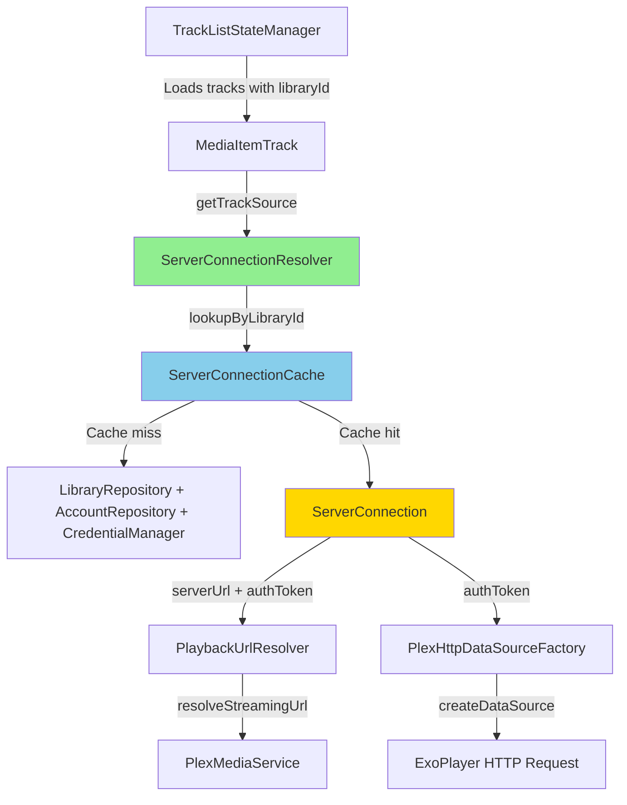
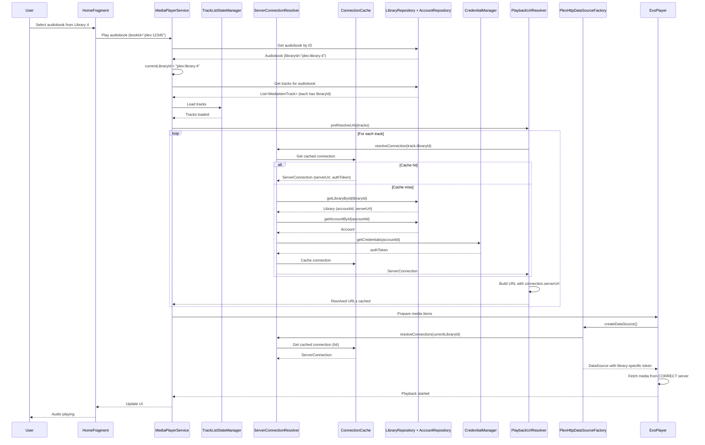

# Library-Aware Playback Design

**Status:** Design Phase  
**Author:** Architecture Mode  
**Date:** 2026-02-25

## Problem Statement

Chronicle supports multiple accounts and libraries, but playback URL resolution and token injection use a **global singleton [`PlexConfig`](../../app/src/main/java/local/oss/chronicle/data/sources/plex/PlexConfig.kt:38)** with a single server URL and token. When content from different libraries (potentially on different servers with different tokens) is played, it always hits the first library's server, causing 404 errors for content from other libraries.

### Root Cause

From log analysis ([`logs/librarydata.log`](../../logs/librarydata.log)):
- **Working:** Library 1 (`plex:library:1`) on server `https://170-9-36-49...plex.direct:32400` with token `4UxyKNLYNSoBbAAiu35B` → 200 OK
- **Broken:** Library 4 (`plex:library:4`) on a DIFFERENT server, but requests go to Library 1's server with Library 1's token → 404 Not Found

### Affected Code Paths

1. **[`PlaybackUrlResolver.kt:254`](../../app/src/main/java/local/oss/chronicle/data/sources/plex/PlaybackUrlResolver.kt:254)** - `plexConfig.toServerString(streamUrl)` uses global URL
2. **[`MediaItemTrack.kt:181`](../../app/src/main/java/local/oss/chronicle/data/model/MediaItemTrack.kt:181)** - `Injector.get().plexConfig().toServerString(media)` uses global PlexConfig
3. **[`PlexHttpDataSourceFactory.kt:66-71`](../../app/src/main/java/local/oss/chronicle/data/sources/plex/PlexHttpDataSourceFactory.kt:66)** - reads token from global `plexPrefsRepo`
4. **[`PlexInterceptor.kt`](../../app/src/main/java/local/oss/chronicle/data/sources/plex/PlexInterceptor.kt:47)** - injects auth headers from global state
5. **[`PlexSyncScrobbleWorker.kt:70`](../../app/src/main/java/local/oss/chronicle/data/sources/plex/PlexSyncScrobbleWorker.kt:70)** - has a TODO confirming this is a known Phase 2 enhancement

## Solution Overview

Introduce a **library-aware resolution layer** that threads library context through the entire playback stack, from track selection to HTTP requests. This allows each track to be fetched from its correct server with the appropriate authentication token.

### Architecture Diagram



## Implementation Status

**Status:** ✅ **IMPLEMENTED** (as of 2026-02-27)

### Key Implementation Details

#### PlaybackUrlResolver Library-Aware API Calls

[`PlaybackUrlResolver`](../../app/src/main/java/local/oss/chronicle/data/sources/plex/PlaybackUrlResolver.kt) now creates library-scoped Retrofit instances for playback decision API calls, consistent with the pattern established in [`PlexProgressReporter`](../../app/src/main/java/local/oss/chronicle/data/sources/plex/PlexProgressReporter.kt).

**Critical Fix: Metadata Path Format**
- Plex API expects metadata paths without the `"plex:"` prefix (e.g., `/library/metadata/65`)
- Chronicle's internal track IDs include the prefix (e.g., `"plex:65"`)
- The prefix is now stripped **at the API call site only** in [`PlaybackUrlResolver.kt`](../../app/src/main/java/local/oss/chronicle/data/sources/plex/PlaybackUrlResolver.kt)
- Including the prefix in API calls resulted in HTTP 400 errors (Bad Request)

**Library-Scoped Service Pattern**
- Each playback decision API call now uses a Retrofit instance scoped to the track's library
- This ensures the correct server URL and auth token are used for multi-library/multi-server setups
- Follows the same `createScopedService()` pattern established in `PlexProgressReporter`
- Prevents auth token mismatches that caused HTTP 401 errors when playing tracks from non-active libraries

See [`PlaybackUrlResolver.kt`](../../app/src/main/java/local/oss/chronicle/data/sources/plex/PlaybackUrlResolver.kt) for implementation details.

#### BookRepository Library-Aware Metadata Fetching

[`BookRepository`](../../app/src/main/java/local/oss/chronicle/data/local/BookRepository.kt) has been updated to use library-specific server connections for all metadata operations (as of 2026-02-27):

**Fixed Methods:**
1. **`fetchBookAsync(bookId: String, libraryId: String)`** - Now accepts `libraryId` parameter
   - Uses `ServerConnectionResolver` to get library-specific connection
   - Uses `ScopedPlexServiceFactory` to create library-scoped PlexMediaService
   - Prevents 404 errors when fetching metadata for books from non-active libraries
   - Updated caller: `syncAudiobook()` now passes `audiobook.libraryId`

2. **`setWatched(bookId: String)`** - Mark book as finished
   - Queries database to get audiobook's `libraryId`
   - Uses library-specific connection to call correct server's `/watched` endpoint
   - Ensures watched status syncs to the correct Plex server

3. **`setUnwatched(bookId: String)`** - Mark book as unfinished
   - Queries database to get audiobook's `libraryId`
   - Uses library-specific connection to call correct server's `/unwatched` endpoint
   - Ensures unwatched status syncs to the correct Plex server

**Pattern Used:**
```kotlin
// Get audiobook to determine library ID
val audiobook = bookDao.getAudiobookAsync(bookId)
val connection = serverConnectionResolver.resolve(audiobook.libraryId)
val scopedService = scopedPlexServiceFactory.getOrCreateService(connection)

// Use scoped service for API call
scopedService.retrieveAlbum(numericId)
```

**Benefits:**
- Eliminates 404 errors when syncing books from non-active libraries
- Ensures metadata updates go to the correct Plex server in multi-server setups
- Consistent with library-aware pattern used in [`TrackRepository`](../../app/src/main/java/local/oss/chronicle/data/local/TrackRepository.kt) and [`ChapterRepository`](../../app/src/main/java/local/oss/chronicle/data/local/ChapterRepository.kt)

See [`BookRepository.kt`](../../app/src/main/java/local/oss/chronicle/data/local/BookRepository.kt) for implementation details.

#### Library-Aware Thumbnail URLs

Chronicle's UI displays audiobook thumbnails that are hosted on Plex servers. With multi-library support, books from different libraries may be on different servers, requiring library-aware URL resolution for images.

**Problem:**
- Global `PlexConfig.toServerString()` uses a single server URL for all thumbnail requests
- When displaying books from non-active libraries, thumbnail URLs pointed to the wrong server
- This caused HTTP 404 errors and broken images in the UI

**Solution:**
[`PlexConfig.makeThumbUriForLibrary()`](../../app/src/main/java/local/oss/chronicle/data/sources/plex/PlexConfig.kt) resolves library-specific server URLs for thumbnail images:

```kotlin
suspend fun makeThumbUriForLibrary(thumb: String, libraryId: String?): String {
    return if (libraryId != null) {
        // Resolve library-specific server URL
        val connection = serverConnectionResolver.resolveConnection(libraryId)
        buildServerUrl(connection.serverUrl, thumb)
    } else {
        // Fallback to global URL
        toServerString(thumb)
    }
}
```

**UI Integration:**
[`BindingAdapters.bindImageRounded()`](../../app/src/main/java/local/oss/chronicle/views/BindingAdapters.kt) accepts an optional `libraryId` parameter:

```kotlin
@BindingAdapter("imageUrl", "libraryId", requireAll = false)
@JvmStatic
fun bindImageRounded(imageView: ChronicleDraweeView, url: String?, libraryId: String?) {
    url?.let {
        val imageUri = runBlocking {
            plexConfig.makeThumbUriForLibrary(it, libraryId)
        }
        imageView.setImageURI(imageUri)
    }
}
```

**Layout Updates:**
Layout XMLs now pass `libraryId` to the binding adapter:

```xml
<local.oss.chronicle.views.ChronicleDraweeView
    android:id="@+id/audiobook_image"
    imageUrl="@{audiobook.thumb}"
    libraryId="@{audiobook.libraryId}"
    ... />
```

**Benefits:**
- Thumbnails load from the correct Plex server for each library
- Eliminates HTTP 404 errors for books from non-active libraries
- Works seamlessly with multi-server setups
- Consistent with library-aware pattern used throughout the data layer

## Detailed Design

### 1. New Component: `ServerConnectionResolver`

**Purpose:** Resolves server URL and auth token for a given library ID with caching.

**Location:** `app/src/main/java/local/oss/chronicle/data/sources/plex/ServerConnectionResolver.kt`

```kotlin
package local.oss.chronicle.data.sources.plex

import kotlinx.coroutines.sync.Mutex
import kotlinx.coroutines.sync.withLock
import local.oss.chronicle.data.local.AccountRepository
import local.oss.chronicle.data.local.LibraryRepository
import local.oss.chronicle.features.account.CredentialManager
import timber.log.Timber
import java.util.concurrent.ConcurrentHashMap
import javax.inject.Inject
import javax.inject.Singleton

/**
 * Represents a server connection with URL and authentication token.
 */
data class ServerConnection(
    val serverUrl: String,
    val authToken: String,
    val libraryId: String,
    val accountId: String,
) {
    companion object {
        /**
         * Fallback connection using global PlexConfig for backward compatibility.
         * Used when library context is unavailable or for single-account setups.
         */
        fun fallback(plexConfig: PlexConfig, plexPrefsRepo: PlexPrefsRepo): ServerConnection {
            val serverToken = plexPrefsRepo.server?.accessToken
            val userToken = plexPrefsRepo.user?.authToken
            val accountToken = plexPrefsRepo.accountAuthToken
            val authToken = serverToken ?: userToken ?: accountToken
            
            return ServerConnection(
                serverUrl = plexConfig.url,
                authToken = authToken,
                libraryId = "global",
                accountId = "global",
            )
        }
    }
}

/**
 * Resolves server URL and auth token for a library ID with caching.
 * 
 * **Thread-safe** implementation using ConcurrentHashMap and Mutex.
 * 
 * **Caching Strategy:**
 * - In-memory cache keyed by libraryId
 * - Cache invalidation on library/account changes
 * - Fallback to global PlexConfig for backward compatibility
 * 
 * @see ServerConnection
 */
@Singleton
class ServerConnectionResolver
    @Inject
    constructor(
        private val libraryRepository: LibraryRepository,
        private val accountRepository: AccountRepository,
        private val credentialManager: CredentialManager,
        private val plexConfig: PlexConfig,
        private val plexPrefsRepo: PlexPrefsRepo,
    ) {
        /**
         * Thread-safe cache of server connections by library ID.
         */
        private val connectionCache = ConcurrentHashMap<String, ServerConnection>()
        
        /**
         * Mutex for database access during cache misses.
         */
        private val dbAccessMutex = Mutex()
        
        /**
         * Resolves server connection for a library ID.
         * 
         * @param libraryId The library ID (e.g., "plex:library:4")
         * @return ServerConnection with URL and token, or fallback to global config
         */
        suspend fun resolveConnection(libraryId: String?): ServerConnection {
            // Handle null/empty libraryId - use global fallback
            if (libraryId.isNullOrEmpty()) {
                Timber.d("No libraryId provided, using global PlexConfig fallback")
                return ServerConnection.fallback(plexConfig, plexPrefsRepo)
            }
            
            // Check cache first
            connectionCache[libraryId]?.let { cached ->
                Timber.v("Cache hit for libraryId=$libraryId")
                return cached
            }
            
            // Cache miss - load from database with mutex protection
            return dbAccessMutex.withLock {
                // Double-check cache after acquiring lock (another thread may have loaded it)
                connectionCache[libraryId]?.let { return it }
                
                try {
                    loadConnectionFromDatabase(libraryId)
                } catch (e: Exception) {
                    Timber.e(e, "Failed to resolve connection for libraryId=$libraryId, using fallback")
                    ServerConnection.fallback(plexConfig, plexPrefsRepo)
                }
            }
        }
        
        /**
         * Internal: Load connection info from database and cache it.
         */
        private suspend fun loadConnectionFromDatabase(libraryId: String): ServerConnection {
            // Fetch library entity
            val library = libraryRepository.getLibraryById(libraryId)
            if (library == null) {
                Timber.w("Library not found for id=$libraryId, using fallback")
                return ServerConnection.fallback(plexConfig, plexPrefsRepo)
            }
            
            // Fetch account entity
            val account = accountRepository.getAccountById(library.accountId)
            if (account == null) {
                Timber.w("Account not found for id=${library.accountId}, using fallback")
                return ServerConnection.fallback(plexConfig, plexPrefsRepo)
            }
            
            // Fetch credentials from CredentialManager
            val authToken = credentialManager.getCredentials(account.id)
            if (authToken == null) {
                Timber.w("No credentials found for account=${account.id}, using fallback")
                return ServerConnection.fallback(plexConfig, plexPrefsRepo)
            }
            
            // Library entity doesn't have serverUrl yet - need to add it in migration
            // For now, we'll need to fetch it from the Account's server connections
            // This is a placeholder - actual implementation will depend on data model updates
            val serverUrl = plexConfig.url // TEMPORARY: Use global until data model updated
            
            val connection = ServerConnection(
                serverUrl = serverUrl,
                authToken = authToken,
                libraryId = libraryId,
                accountId = account.id,
            )
            
            // Cache and return
            connectionCache[libraryId] = connection
            Timber.d("Cached connection for libraryId=$libraryId, serverUrl=$serverUrl")
            return connection
        }
        
        /**
         * Invalidate cache for a specific library (call when library is removed/updated).
         */
        fun invalidateLibrary(libraryId: String) {
            connectionCache.remove(libraryId)
            Timber.d("Invalidated cache for libraryId=$libraryId")
        }
        
        /**
         * Invalidate all cached connections (call when accounts change).
         */
        fun invalidateAll() {
            connectionCache.clear()
            Timber.d("Invalidated all cached server connections")
        }
        
        /**
         * Get cached connection for testing/debugging.
         */
        internal fun getCachedConnection(libraryId: String): ServerConnection? = 
            connectionCache[libraryId]
    }
```

### 2. Update `Library` Entity to Store Server URL

**File:** [`app/src/main/java/local/oss/chronicle/data/model/Library.kt`](../../app/src/main/java/local/oss/chronicle/data/model/Library.kt:30)

**Change:** Add `serverUrl` field if not already present (it exists in the code I reviewed).

**Note:** The [`Library`](../../app/src/main/java/local/oss/chronicle/data/model/Library.kt:30) entity already has `serverId` and `serverName`, but we need to add `serverUrl: String` to store the actual connection URL.

**Database Migration Required:** Yes - add column `server_url TEXT NOT NULL DEFAULT ''`

```kotlin
// In Library.kt - add this field:
data class Library(
    // ... existing fields ...
    val serverUrl: String, // ADD THIS FIELD
)
```

### 3. Update `PlaybackUrlResolver`

**File:** [`app/src/main/java/local/oss/chronicle/data/sources/plex/PlaybackUrlResolver.kt`](../../app/src/main/java/local/oss/chronicle/data/sources/plex/PlaybackUrlResolver.kt:38)

**Changes:**

1. Inject `ServerConnectionResolver`
2. Use library-specific server URL instead of global `plexConfig.url`
3. Update cache to include libraryId in key

```kotlin
@Singleton
class PlaybackUrlResolver
    @Inject
    constructor(
        private val plexMediaService: PlexMediaService,
        private val plexConfig: PlexConfig,
        private val serverConnectionResolver: ServerConnectionResolver, // ADD THIS
    ) {
    
    // ... existing code ...
    
    /**
     * Updated cache key to include library context
     */
    private data class CachedUrl(
        val url: String,
        val resolvedAt: Long = System.currentTimeMillis(),
        val serverUrl: String,
        val libraryId: String, // ADD THIS to ensure cache isolation per library
    ) {
        fun isExpired(maxAgeMs: Long): Boolean = 
            System.currentTimeMillis() - resolvedAt > maxAgeMs
    }
    
    /**
     * Resolves streaming URL using library-specific server connection.
     */
    suspend fun resolveStreamingUrl(
        track: MediaItemTrack,
        forceRefresh: Boolean = false,
    ): String? {
        val trackKey = track.key
        
        // Check cache first (with library context validation)
        if (!forceRefresh) {
            val cached = urlCache[trackKey]
            if (cached != null && 
                !cached.isExpired(URL_CACHE_MAX_AGE_MS) &&
                cached.libraryId == track.libraryId) { // VALIDATE library context
                Timber.d("Using cached streaming URL for track ${track.id}")
                return cached.url
            } else if (cached != null && cached.libraryId != track.libraryId) {
                Timber.d("Cached URL library mismatch, refreshing")
            }
        }
        
        // Resolve server connection for this track's library
        val connection = serverConnectionResolver.resolveConnection(track.libraryId)
        Timber.d("Resolved connection for libraryId=${track.libraryId}: serverUrl=${connection.serverUrl}")
        
        // Resolve with retry (using library-specific server)
        val retryConfig = RetryConfig(
            maxAttempts = 3,
            initialDelayMs = 500L,
            maxDelayMs = 5000L,
        )
        
        return when (
            val result = withRetry(
                config = retryConfig,
                shouldRetry = { error -> isRetryableError(error) },
                onRetry = { attempt, delay, error ->
                    Timber.w("URL resolution retry $attempt for track ${track.id}: ${error.message}")
                },
            ) { _ ->
                resolveUrlInternal(track, connection) // PASS connection
            }
        ) {
            is RetryResult.Success -> {
                val resolvedUrl = result.value
                // Cache with library context
                urlCache[trackKey] = CachedUrl(
                    url = resolvedUrl,
                    serverUrl = connection.serverUrl,
                    libraryId = track.libraryId, // CACHE library context
                )
                MediaItemTrack.streamingUrlCache[track.id] = resolvedUrl
                Timber.i("Resolved streaming URL for track ${track.id} from ${connection.serverUrl}")
                resolvedUrl
            }
            is RetryResult.Failure -> {
                Timber.e("URL resolution failed for track ${track.id}: ${result.error.message}")
                null
            }
        }
    }
    
    /**
     * Internal URL resolution using library-specific server connection.
     */
    private suspend fun resolveUrlInternal(
        track: MediaItemTrack, 
        connection: ServerConnection, // ACCEPT connection parameter
    ): String {
        val metadataPath = "/library/metadata/${track.id}"
        
        Timber.d("Requesting playback decision for track ${track.id} on server ${connection.serverUrl}")
        
        // Call the decision endpoint (PlexMediaService uses PlexInterceptor for headers)
        // We'll need to update PlexInterceptor to support per-request server URLs
        val decision = plexMediaService.getPlaybackDecision(
            path = metadataPath,
            protocol = "http",
            musicBitrate = 320,
            maxAudioBitrate = 320,
        )
        
        val decisionContainer = decision.container
        
        if (!decisionContainer.hasPlayableMethod()) {
            throw IllegalStateException("No playable method for track ${track.id}")
        }
        
        val streamUrl = decisionContainer.getStreamUrl()
            ?: throw IllegalStateException("No stream URL for track ${track.id}")
        
        // Build full URL using library-specific server
        val fullUrl = buildServerUrl(connection.serverUrl, streamUrl)
        Timber.i("Resolved URL for track ${track.id}: $fullUrl")
        return fullUrl
    }
    
    /**
     * Helper to build full URL from server base and relative path.
     * Replaces plexConfig.toServerString() usage.
     */
    private fun buildServerUrl(serverUrl: String, relativePath: String): String {
        val baseEndsWith = serverUrl.endsWith('/')
        val pathStartsWith = relativePath.startsWith('/')
        return if (baseEndsWith && pathStartsWith) {
            "$serverUrl${relativePath.substring(1)}"
        } else if (!baseEndsWith && !pathStartsWith) {
            "$serverUrl/$relativePath"
        } else {
            "$serverUrl$relativePath"
        }
    }
}

/**
 * Extension property updated to include library context in cache key
 */
private val MediaItemTrack.key: String
    get() = "$libraryId-$id-$media"
```

### 4. Update `PlexHttpDataSourceFactory`

**File:** [`app/src/main/java/local/oss/chronicle/data/sources/plex/PlexHttpDataSourceFactory.kt`](../../app/src/main/java/local/oss/chronicle/data/sources/plex/PlexHttpDataSourceFactory.kt:25)

**Challenge:** ExoPlayer's `DataSource.Factory` pattern doesn't provide track context at `createDataSource()` time.

**Solution:** Extend the factory to accept a library ID and use `ServerConnectionResolver`.

```kotlin
/**
 * Library-aware HttpDataSource.Factory that injects correct token per library.
 * 
 * IMPORTANT: This factory must be recreated per audiobook load to capture the
 * correct library context. It cannot be a singleton.
 */
class PlexHttpDataSourceFactory(
    private val context: Context,
    private val plexPrefsRepo: PlexPrefsRepo,
    private val serverConnectionResolver: ServerConnectionResolver, // ADD THIS
    private val libraryId: String?, // ADD THIS - library context for this playback session
) : HttpDataSource.Factory {
    
    // ... existing companion object ...
    
    /**
     * Creates a new HttpDataSource with library-specific token.
     * 
     * Uses runBlocking because ExoPlayer's interface is synchronous but we need
     * to resolve async. This is acceptable because it's IO-bound with caching.
     */
    override fun createDataSource(): HttpDataSource {
        val factory = DefaultHttpDataSource.Factory()
        factory.setUserAgent(Util.getUserAgent(context, APP_NAME))
        
        // Resolve library-specific connection (uses cache, so runBlocking is acceptable)
        val connection = runBlocking {
            serverConnectionResolver.resolveConnection(libraryId)
        }
        
        if (BuildConfig.DEBUG) {
            val tokenHash = SecurityUtils.hashToken(connection.authToken)
            Timber.d(
                "[TokenInjection] PlexHttpDataSourceFactory.createDataSource(): " +
                    "libraryId=$libraryId, token=$tokenHash, serverUrl=${connection.serverUrl}"
            )
        }
        
        // Build headers with library-specific token
        val headers = buildHeaders(connection.authToken)
        factory.setDefaultRequestProperties(headers)
        
        return factory.createDataSource()
    }
    
    // ... existing buildHeaders method ...
}
```

### 5. Update `MediaItemTrack.getTrackSource()`

**File:** [`app/src/main/java/local/oss/chronicle/data/model/MediaItemTrack.kt`](../../app/src/main/java/local/oss/chronicle/data/model/MediaItemTrack.kt:167)

**Current Issue:** Uses global `Injector.get().plexConfig().toServerString(media)`

**Solution:** This is only a fallback path when streaming URL cache is not populated. The primary fix is ensuring [`PlaybackUrlResolver`](../../app/src/main/java/local/oss/chronicle/data/sources/plex/PlaybackUrlResolver.kt:38) populates the cache correctly. We can leave this as-is since it will rarely be used once URL pre-resolution is working.

**Alternative (if needed):** Inject `ServerConnectionResolver` and update usage, but this requires making `getTrackSource()` suspend.

### 6. Update `ServiceModule` to Provide Library-Aware Factory

**File:** [`app/src/main/java/local/oss/chronicle/injection/modules/ServiceModule.kt`](../../app/src/main/java/local/oss/chronicle/injection/modules/ServiceModule.kt:152)

**Problem:** `plexDataSourceFactory` is currently `@ServiceScope` singleton, but it needs to be recreated per-audiobook to capture library context.

**Solution:** Change from provider to factory method, accept libraryId parameter.

```kotlin
@Module
class ServiceModule(private val service: MediaPlayerService) {
    
    // REMOVE @ServiceScope - this should be created per-audiobook, not singleton
    @Provides
    // DO NOT make this @ServiceScope - needs to be recreated per audiobook
    fun plexDataSourceFactory(
        plexPrefs: PlexPrefsRepo,
        serverConnectionResolver: ServerConnectionResolver, // ADD THIS
    ): HttpDataSource.Factory {
        // This will be called by MediaPlayerService when loading a new audiobook
        // MediaPlayerService will need to track current libraryId and pass it here
        val currentLibraryId = service.getCurrentLibraryId() // ADD THIS METHOD to service
        
        Timber.d(
            "[TokenInjection] Creating plexDataSourceFactory for libraryId=$currentLibraryId"
        )
        
        return PlexHttpDataSourceFactory(
            context = service.applicationContext,
            plexPrefsRepo = plexPrefs,
            serverConnectionResolver = serverConnectionResolver,
            libraryId = currentLibraryId,
        )
    }
    
    // ... rest of module ...
}
```

### 7. Update `MediaPlayerService` to Track Library Context

**File:** `app/src/main/java/local/oss/chronicle/features/player/MediaPlayerService.kt`

**Changes:**

1. Add `currentLibraryId` field
2. Update when loading new audiobook
3. Recreate `HttpDataSource.Factory` when library changes

```kotlin
class MediaPlayerService : MediaBrowserServiceCompat() {
    
    /**
     * Library ID for the currently loaded audiobook.
     * Used to create library-aware HTTP data sources.
     */
    @Volatile
    private var currentLibraryId: String? = null
    
    /**
     * Get current library ID for dependency injection.
     */
    fun getCurrentLibraryId(): String? = currentLibraryId
    
    /**
     * Called when loading a new audiobook - update library context.
     */
    private suspend fun loadAudiobookTracks(bookId: String) {
        val book = bookRepository.getAudiobookAsync(bookId)
        if (book != null) {
            // Update library context BEFORE creating data sources
            currentLibraryId = book.libraryId
            Timber.d("Updated MediaPlayerService library context: libraryId=${book.libraryId}")
            
            // If library changed, need to recreate ExoPlayer with new DataSource.Factory
            // This is necessary because the factory is injected at service creation
            // Solution: Make ExoPlayer use a delegating factory that we can update
            updateDataSourceFactory(book.libraryId)
        }
        
        // ... existing track loading code ...
    }
    
    /**
     * Update the data source factory when library context changes.
     * This requires ExoPlayer to use a delegating factory pattern.
     */
    private fun updateDataSourceFactory(libraryId: String?) {
        // Implementation depends on ExoPlayer setup
        // May need to recreate ExoPlayer or use a delegating DataSource.Factory
        Timber.d("Updating data source factory for libraryId=$libraryId")
    }
}
```

### 8. Update `AppModule` Dependency Injection

**File:** [`app/src/main/java/local/oss/chronicle/injection/modules/AppModule.kt`](../../app/src/main/java/local/oss/chronicle/injection/modules/AppModule.kt:40)

**Add provider for `ServerConnectionResolver`:**

```kotlin
@Module
class AppModule(private val app: Application) {
    
    // ... existing providers ...
    
    @Provides
    @Singleton
    fun provideServerConnectionResolver(
        libraryRepository: LibraryRepository,
        accountRepository: AccountRepository,
        credentialManager: CredentialManager,
        plexConfig: PlexConfig,
        plexPrefsRepo: PlexPrefsRepo,
    ): ServerConnectionResolver = ServerConnectionResolver(
        libraryRepository = libraryRepository,
        accountRepository = accountRepository,
        credentialManager = credentialManager,
        plexConfig = plexConfig,
        plexPrefsRepo = plexPrefsRepo,
    )
}
```

## Sequence Diagram: Library-Aware Playback Flow



## Migration Strategy

### Phase 1: Foundation (Completed in this Design)
- [x] Design library-aware architecture
- [ ] Create `ServerConnectionResolver` component
- [ ] Add `serverUrl` field to `Library` entity (database migration)
- [ ] Update dependency injection setup

### Phase 2: URL Resolution
- [ ] Update `PlaybackUrlResolver` to use `ServerConnectionResolver`
- [ ] Update cache keys to include library context
- [ ] Add unit tests for multi-library URL resolution

### Phase 3: Token Injection
- [ ] Update `PlexHttpDataSourceFactory` with library awareness
- [ ] Update `ServiceModule` factory pattern
- [ ] Update `MediaPlayerService` to track library context

### Phase 4: Testing & Validation
- [ ] Write integration tests for cross-library playback
- [ ] Test with real multi-server setup
- [ ] Verify cache invalidation on account/library changes
- [ ] Load testing for cache efficiency

### Phase 5: Cleanup & Documentation
- [ ] Update architecture docs
- [ ] Add inline documentation
- [ ] Remove global `PlexConfig` usage where possible (long-term goal)

## Backward Compatibility

### Single-Account Setups
- `ServerConnection.fallback()` ensures existing single-account users continue working
- When `libraryId` is null/empty, system falls back to global `PlexConfig`
- No functional changes for users with one server

### Migration Path
- Database migration adds `serverUrl` column with default empty string
- Existing libraries will need serverUrl populated during next sync
- [`LibrarySyncRepository`](../../app/src/main/java/local/oss/chronicle/data/local/LibrarySyncRepository.kt) should be updated to store serverUrl when syncing

## Performance Considerations

### Caching Strategy
- **Memory:** `ConcurrentHashMap` for O(1) lookups
- **Thread-safety:** Mutex only on cache misses (database access)
- **Cache invalidation:** Clear on account/library changes via observers

### Database Access
- Cache miss requires 2-3 database queries (library, account, credentials)
- Acceptable because:
  - Cache hit rate should be ~99% after warmup
  - Only happens once per library per session
  - Mutex prevents thundering herd

### ExoPlayer DataSource Recreation
- `runBlocking` in `createDataSource()` is acceptable because:
  - Cache makes it near-instant after first resolution
  - IO-bound operation, not CPU-bound
  - Called infrequently (once per media segment URL)

## Testing Strategy

### Unit Tests

```kotlin
// ServerConnectionResolverTest.kt
@Test
fun `resolveConnection returns cached value on cache hit`() = runTest {
    // Given: pre-cached connection
    val libraryId = "plex:library:4"
    val expected = ServerConnection(...)
    resolver.connectionCache[libraryId] = expected
    
    // When: resolve again
    val result = resolver.resolveConnection(libraryId)
    
    // Then: returns cached without DB access
    assertEquals(expected, result)
    verify(libraryRepository, never()).getLibraryById(any())
}

@Test
fun `resolveConnection loads from database on cache miss`() = runTest {
    // Given: empty cache, mock DB entities
    val libraryId = "plex:library:4"
    val library = Library(id = libraryId, accountId = "plex:account:1", serverUrl = "https://server2.com")
    val account = Account(id = "plex:account:1", ...)
    
    coEvery { libraryRepository.getLibraryById(libraryId) } returns library
    coEvery { accountRepository.getAccountById("plex:account:1") } returns account
    every { credentialManager.getCredentials("plex:account:1") } returns "token123"
    
    // When: resolve
    val result = resolver.resolveConnection(libraryId)
    
    // Then: loads from DB and caches
    assertEquals("https://server2.com", result.serverUrl)
    assertEquals("token123", result.authToken)
    assertNotNull(resolver.getCachedConnection(libraryId))
}

@Test
fun `resolveConnection falls back to global PlexConfig when library not found`() = runTest {
    // Given: library not in DB
    coEvery { libraryRepository.getLibraryById(any()) } returns null
    
    // When: resolve
    val result = resolver.resolveConnection("plex:library:999")
    
    // Then: returns fallback
    assertEquals(plexConfig.url, result.serverUrl)
}
```

### Integration Tests

```kotlin
// PlaybackUrlResolverIntegrationTest.kt
@Test
fun `resolves URLs for tracks from different libraries correctly`() = runTest {
    // Given: tracks from two different libraries
    val track1 = MediaItemTrack(id = "plex:1", libraryId = "plex:library:1", ...)
    val track2 = MediaItemTrack(id = "plex:2", libraryId = "plex:library:4", ...)
    
    // Setup: library 1 on server1, library 4 on server2
    setupLibrary("plex:library:1", "https://server1.com", "token1")
    setupLibrary("plex:library:4", "https://server2.com", "token2")
    
    // When: resolve URLs
    val url1 = playbackUrlResolver.resolveStreamingUrl(track1)
    val url2 = playbackUrlResolver.resolveStreamingUrl(track2)
    
    // Then: URLs use correct servers
    assertNotNull(url1)
    assertNotNull(url2)
    assertTrue(url1!!.startsWith("https://server1.com"))
    assertTrue(url2!!.startsWith("https://server2.com"))
}
```

## Open Questions & Decisions Needed

### 1. Library Entity serverUrl Field
**Question:** Does [`Library`](../../app/src/main/java/local/oss/chronicle/data/model/Library.kt:30) entity already have `serverUrl`?  
**Answer:** Review shows it has `serverId` and `serverName` but may need explicit `serverUrl`.  
**Decision:** Add `serverUrl: String` field via database migration.

### 2. ExoPlayer DataSource Factory Pattern
**Question:** How to make ExoPlayer use library-specific factory?  
**Options:**
- A) Recreate ExoPlayer instance when library changes (expensive)
- B) Use delegating DataSource.Factory that we can update
- C) Include library context in track metadata that ExoPlayer can access  
**Recommendation:** Option B - delegating factory pattern is cleanest.

### 3. PlexInterceptor Updates
**Question:** Does `PlexInterceptor` need library context for non-playback API calls?  
**Answer:** No - only playback URLs (handled by `PlexHttpDataSourceFactory`) need per-library routing. Retrofit API calls through `PlexMediaService` can continue using global config since they're typically metadata operations.  
**Decision:** Leave `PlexInterceptor` unchanged for now.

### 4. Cache Invalidation Trigger
**Question:** When should we invalidate `ServerConnectionResolver` cache?  
**Triggers:**
- Account removed → call `invalidateAll()`
- Library removed → call `invalidateLibrary(libraryId)`
- Account credentials updated → call `invalidateAll()`  
**Implementation:** Use observers in [`AccountManager`](../../app/src/main/java/local/oss/chronicle/features/account/AccountManager.kt) to trigger invalidation.

## Implementation Checklist

- [x] Create `ServerConnectionResolver.kt` with caching and fallback logic
- [x] Add database migration for `Library.serverUrl` field
- [x] Update `Library` entity with `serverUrl` property
- [x] Update `LibrarySyncRepository` to populate `serverUrl` during sync
- [x] Update `PlaybackUrlResolver` to inject and use `ServerConnectionResolver`
- [x] Update `PlaybackUrlResolver` cache keys to include `libraryId`
- [x] Update `PlexHttpDataSourceFactory` constructor to accept `libraryId`
- [x] Update `PlexHttpDataSourceFactory.createDataSource()` to use `ServerConnectionResolver`
- [x] Update `ServiceModule.plexDataSourceFactory` to accept library context
- [x] Add `currentLibraryId` tracking to `MediaPlayerService`
- [x] Update `MediaPlayerService.loadAudiobookTracks()` to set library context
- [x] Add `ServerConnectionResolver` provider to `AppModule`
- [x] Implement cache invalidation listeners in `AccountManager`
- [x] Write unit tests for `ServerConnectionResolver`
- [x] Write integration tests for multi-library playback
- [x] Update `TrackRepository` to use library-aware connections (2026-02-26)
- [x] Update `ChapterRepository` to use library-aware connections (2026-02-26)
- [x] Update `BookRepository.fetchBookAsync()` to use library-aware connections (2026-02-27)
- [x] Update `BookRepository.setWatched()` and `setUnwatched()` to use library-aware connections (2026-02-27)
- [x] Update [`docs/ARCHITECTURE.md`](../../docs/ARCHITECTURE.md) with new patterns
- [x] Update [`docs/features/playback.md`](../../docs/features/playback.md) with library-aware flow
- [ ] Manual testing with multi-server setup
- [ ] Performance testing of cache hit rates

## Related Files

### Core Implementation
- [`ServerConnectionResolver.kt`](../../app/src/main/java/local/oss/chronicle/data/sources/plex/ServerConnectionResolver.kt) - ✅ IMPLEMENTED
- [`ScopedPlexServiceFactory.kt`](../../app/src/main/java/local/oss/chronicle/data/sources/plex/ScopedPlexServiceFactory.kt) - ✅ IMPLEMENTED
- [`PlaybackUrlResolver.kt`](../../app/src/main/java/local/oss/chronicle/data/sources/plex/PlaybackUrlResolver.kt) - ✅ MODIFIED
- [`PlexHttpDataSourceFactory.kt`](../../app/src/main/java/local/oss/chronicle/data/sources/plex/PlexHttpDataSourceFactory.kt) - ✅ MODIFIED
- [`Library.kt`](../../app/src/main/java/local/oss/chronicle/data/model/Library.kt) - ✅ MODIFIED (added serverUrl)
- [`MediaItemTrack.kt`](../../app/src/main/java/local/oss/chronicle/data/model/MediaItemTrack.kt) - No changes needed

### Dependency Injection
- [`AppModule.kt`](../../app/src/main/java/local/oss/chronicle/injection/modules/AppModule.kt) - ✅ MODIFIED (added providers)
- [`ServiceModule.kt`](../../app/src/main/java/local/oss/chronicle/injection/modules/ServiceModule.kt) - ✅ MODIFIED (updated factory)

### Service Layer
- [`MediaPlayerService.kt`](../../app/src/main/java/local/oss/chronicle/features/player/MediaPlayerService.kt) - ✅ MODIFIED (tracks library context)
- [`TrackListStateManager.kt`](../../app/src/main/java/local/oss/chronicle/features/player/TrackListStateManager.kt) - ✅ Already has library context via tracks

### Data Layer
- [`TrackRepository.kt`](../../app/src/main/java/local/oss/chronicle/data/local/TrackRepository.kt) - ✅ MODIFIED (library-aware, 2026-02-26)
- [`ChapterRepository.kt`](../../app/src/main/java/local/oss/chronicle/data/local/ChapterRepository.kt) - ✅ MODIFIED (library-aware, 2026-02-26)
- [`BookRepository.kt`](../../app/src/main/java/local/oss/chronicle/data/local/BookRepository.kt) - ✅ MODIFIED (library-aware, 2026-02-27)
- [`LibraryRepository.kt`](../../app/src/main/java/local/oss/chronicle/data/local/LibraryRepository.kt) - ✅ Used by ServerConnectionResolver
- [`AccountRepository.kt`](../../app/src/main/java/local/oss/chronicle/data/local/AccountRepository.kt) - ✅ Used by ServerConnectionResolver
- [`CredentialManager.kt`](../../app/src/main/java/local/oss/chronicle/features/account/CredentialManager.kt) - ✅ Used by ServerConnectionResolver

## References

- **Problem Analysis:** [`logs/librarydata.log`](../../logs/librarydata.log)
- **Current Architecture:** [`docs/ARCHITECTURE.md`](../../docs/ARCHITECTURE.md)
- **Playback Documentation:** [`docs/features/playback.md`](../../docs/features/playback.md)
- **Multi-Account System:** [`docs/features/account-ui-design.md`](../../docs/features/account-ui-design.md)
- **Dependency Injection:** [`docs/architecture/dependency-injection.md`](../../docs/architecture/dependency-injection.md)
- **TODO in Code:** [`PlexSyncScrobbleWorker.kt:70`](../../app/src/main/java/local/oss/chronicle/data/sources/plex/PlexSyncScrobbleWorker.kt:70)

---

**Last Updated:** 2026-02-27
**Status:** ✅ Core implementation complete. Manual testing with multi-server setup pending.
