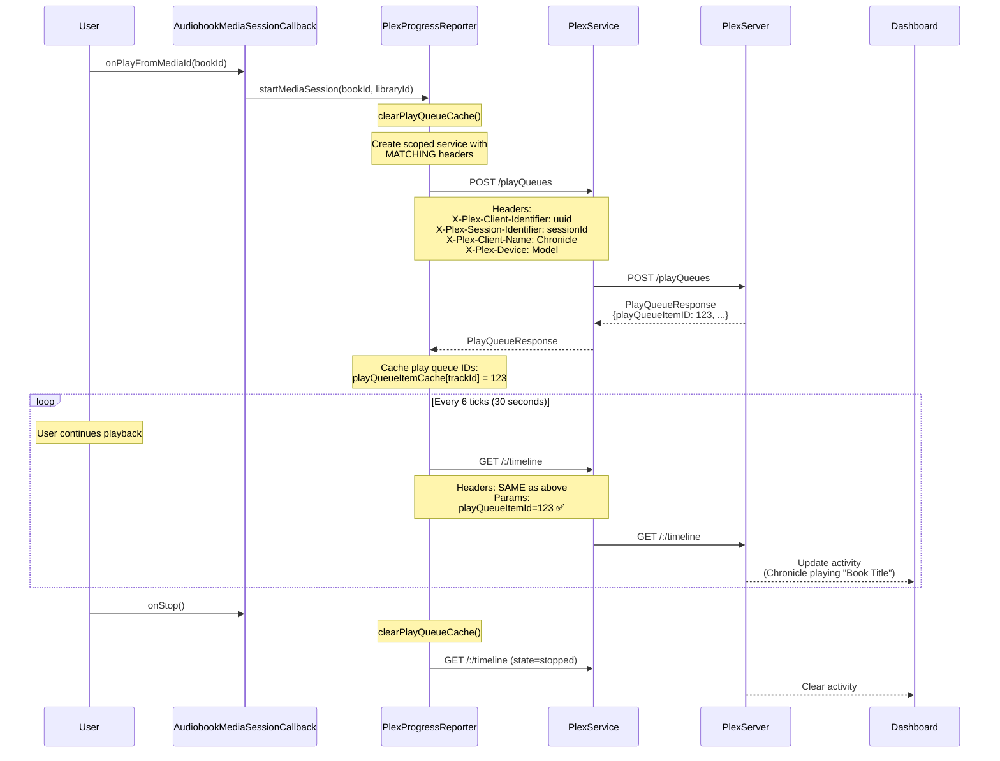

# Plex Dashboard Activity Reporting Fix

## Overview

Chronicle currently sends `POST /playQueues` to create play queues and `GET /:/timeline` for progress updates, but the Plex server dashboard never shows Chronicle as an active streaming client. This document outlines the surgical fixes needed to enable proper dashboard activity reporting.

### Problem Statement

The Plex server dashboard doesn't show Chronicle as actively streaming because:

1. **Inconsistent Client Identifier**: The scoped interceptor in [`PlexProgressReporter`](../../app/src/main/java/local/oss/chronicle/data/sources/plex/PlexProgressReporter.kt) uses `plexConfig.sessionIdentifier` for `X-Plex-Client-Identifier`, while the main [`PlexInterceptor`](../../app/src/main/java/local/oss/chronicle/data/sources/plex/PlexInterceptor.kt) uses `plexPrefsRepo.uuid`. Plex cannot correlate requests with different client identifiers.

2. **Missing Session Headers**: The scoped interceptor lacks critical headers that link timeline updates to sessions:
   - `X-Plex-Session-Identifier`
   - `X-Plex-Client-Name`
   - `X-Plex-Device`
   - `X-Plex-Device-Name`

3. **Missing Play Queue Item IDs**: When `POST /playQueues` returns, it provides `playQueueItemID` values for each track. Chronicle never captures these. [`MediaItemTrack.playQueueItemID`](../../app/src/main/java/local/oss/chronicle/data/model/MediaItemTrack.kt) defaults to `-1`, which is sent in every `GET /:/timeline` call, preventing Plex from associating timeline updates with the play queue.

### Success Criteria

After implementing this fix:
- Chronicle appears in the Plex server dashboard under "Now Playing" when streaming
- Dashboard shows correct book title, progress, and playback state
- Activity disappears when playback stops

## Architecture Changes

### 1. Header Alignment Fix

**File**: [`PlexProgressReporter.kt`](../../app/src/main/java/local/oss/chronicle/data/sources/plex/PlexProgressReporter.kt)

#### Current Implementation (lines 276-294)

```kotlin
private fun createScopedInterceptor(authToken: String): Interceptor {
    return Interceptor { chain ->
        val request =
            chain.request().newBuilder()
                .header("Accept", "application/json")
                .header("X-Plex-Platform", "Android")
                .header("X-Plex-Provides", "player")
                .header("X-Plex-Client-Identifier", plexConfig.sessionIdentifier) // ⚠️ WRONG
                .header("X-Plex-Version", BuildConfig.VERSION_NAME)
                .header("X-Plex-Product", APP_NAME)
                .header("X-Plex-Platform-Version", Build.VERSION.RELEASE)
                .header("X-Plex-Device", Build.MODEL)
                .header("X-Plex-Device-Name", Build.MODEL)
                .header("X-Plex-Token", authToken)
                .build()

        chain.proceed(request)
    }
}
```

#### Required Changes

```kotlin
/**
 * Creates an OkHttp interceptor with request-scoped auth token.
 * 
 * CRITICAL: Headers must match PlexInterceptor exactly for Plex to correlate
 * play queue creation (startMediaSession) with timeline updates (reportProgress).
 * 
 * Uses plexPrefsRepo.uuid (NOT plexConfig.sessionIdentifier) for X-Plex-Client-Identifier
 * to ensure consistency with main interceptor and proper dashboard correlation.
 *
 * @param authToken The auth token for this specific request
 * @return Interceptor that adds Plex headers to requests
 */
private fun createScopedInterceptor(authToken: String): Interceptor {
    return Interceptor { chain ->
        val request =
            chain.request().newBuilder()
                .header("Accept", "application/json")
                .header("X-Plex-Platform", "Android")
                .header("X-Plex-Provides", "player")
                .header("X-Plex-Client-Identifier", plexPrefsRepo.uuid) // ✅ FIXED - matches PlexInterceptor
                .header("X-Plex-Version", BuildConfig.VERSION_NAME)
                .header("X-Plex-Product", APP_NAME)
                .header("X-Plex-Platform-Version", Build.VERSION.RELEASE)
                .header("X-Plex-Session-Identifier", plexConfig.sessionIdentifier) // ✅ ADDED
                .header("X-Plex-Client-Name", APP_NAME) // ✅ ADDED
                .header("X-Plex-Device", Build.MODEL) // ✅ FIXED - was already present but value now matches PlexInterceptor
                .header("X-Plex-Device-Name", Build.MODEL)
                .header("X-Plex-Client-Profile-Extra", PlexInterceptor.CLIENT_PROFILE_EXTRA) // ✅ ADDED - required for playback
                .header("X-Plex-Token", authToken)
                .build()

        chain.proceed(request)
    }
}
```

**Dependencies**:
- Add `private val plexPrefsRepo: PlexPrefsRepo` to [`PlexProgressReporter`](../../app/src/main/java/local/oss/chronicle/data/sources/plex/PlexProgressReporter.kt) constructor
- Make `PlexInterceptor.CLIENT_PROFILE_EXTRA` public so it can be referenced

### 2. Play Queue Response Model

**New File**: `app/src/main/java/local/oss/chronicle/data/sources/plex/model/PlayQueueResponse.kt`

```kotlin
package local.oss.chronicle.data.sources.plex.model

import com.squareup.moshi.Json
import com.squareup.moshi.JsonClass

/**
 * Response from POST /playQueues containing play queue item IDs.
 * 
 * Plex uses these IDs to correlate timeline updates with specific tracks
 * in a play queue, which enables dashboard activity reporting.
 */
@JsonClass(generateAdapter = true)
data class PlayQueueResponseWrapper(
    @Json(name = "MediaContainer") val mediaContainer: PlayQueueMediaContainer,
)

@JsonClass(generateAdapter = true)
data class PlayQueueMediaContainer(
    val playQueueID: Long = -1,
    val playQueueSelectedItemID: Long = -1,
    @Json(name = "Metadata")
    val metadata: List<PlayQueueItem> = emptyList(),
)

@JsonClass(generateAdapter = true)
data class PlayQueueItem(
    val ratingKey: String = "",
    val playQueueItemID: Long = -1,
    val title: String = "",
)

/**
 * Maps play queue response to a map of ratingKey -> playQueueItemID.
 * 
 * @return Map of track ID (e.g., "plex:12345") to playQueueItemID
 */
fun PlayQueueResponseWrapper.toPlayQueueItemMap(): Map<String, Long> {
    return mediaContainer.metadata.associate { item ->
        "plex:${item.ratingKey}" to item.playQueueItemID
    }
}
```

### 3. PlexService API Update

**File**: [`PlexService.kt`](../../app/src/main/java/local/oss/chronicle/data/sources/plex/PlexService.kt)

#### Current Implementation (lines 123-131)

```kotlin
@POST("/playQueues")
suspend fun startMediaSession(
    @Query("uri") serverUri: String,
    @Query("type") mediaType: String = MediaType.AUDIO_STRING,
    @Query("repeat") shouldRepeat: Boolean = false,
    @Query("own") isOwnedByUser: Boolean = true,
    @Query("includeChapters") shouldIncludeChapters: Boolean = true,
)
```

#### Required Changes

```kotlin
/**
 * Starts a media session and returns the play queue with item IDs.
 * 
 * The playQueueItemID values in the response MUST be captured and sent
 * in subsequent GET /:/timeline calls for Plex dashboard activity to work.
 *
 * @return PlayQueueResponseWrapper containing playQueueItemID for each track
 */
@POST("/playQueues")
suspend fun startMediaSession(
    @Query("uri") serverUri: String,
    @Query("type") mediaType: String = MediaType.AUDIO_STRING,
    @Query("repeat") shouldRepeat: Boolean = false,
    @Query("own") isOwnedByUser: Boolean = true,
    @Query("includeChapters") shouldIncludeChapters: Boolean = true,
): PlayQueueResponseWrapper
```

### 4. Play Queue State Storage

**File**: [`PlexProgressReporter.kt`](../../app/src/main/java/local/oss/chronicle/data/sources/plex/PlexProgressReporter.kt)

Add in-memory storage for play queue item IDs:

```kotlin
@Singleton
class PlexProgressReporter @Inject constructor(
    private val plexConfig: PlexConfig,
    private val plexPrefsRepo: PlexPrefsRepo, // ✅ NEW dependency
    private val serverConnectionResolver: ServerConnectionResolver,
    private val libraryRepository: LibraryRepository,
) {
    companion object {
        // ... existing constants ...
    }

    /**
     * In-memory cache of play queue item IDs by track ID.
     * 
     * This maps track IDs (e.g., "plex:12345") to their playQueueItemID values
     * returned from POST /playQueues. These IDs are required for timeline updates
     * to appear in the Plex dashboard.
     * 
     * Cleared when playback stops or a new play queue is created.
     * 
     * Thread-safe: ConcurrentHashMap handles concurrent reads/writes from
     * worker threads and main thread.
     */
    private val playQueueItemCache = java.util.concurrent.ConcurrentHashMap<String, Long>()

    /**
     * Clears the play queue item cache.
     * Should be called when playback stops or a new audiobook is loaded.
     */
    fun clearPlayQueueCache() {
        playQueueItemCache.clear()
        Timber.d("Cleared play queue item cache")
    }
    
    // ... rest of class ...
}
```

### 5. Update startMediaSession() Implementation

**File**: [`PlexProgressReporter.kt`](../../app/src/main/java/local/oss/chronicle/data/sources/plex/PlexProgressReporter.kt)

#### Current Implementation (lines 174-236)

```kotlin
suspend fun startMediaSession(
    bookId: String,
    libraryId: String,
) {
    try {
        val numericBookId = bookId.removePrefix("plex:").toIntOrNull()
            ?: throw IllegalArgumentException("Invalid book ID: $bookId")
        
        val connection = /* ... */
        val library = /* ... */
        val serverId = library.serverId
        
        val service = createScopedService(connection)
        val uri = getMediaItemUri(serverId, numericBookId.toString())
        
        service.startMediaSession(uri) // ⚠️ Response discarded
        Timber.i("Started media session for book $bookId...")
    } catch (e: Exception) {
        Timber.e(e, "Failed to start media session...")
    }
}
```

#### Required Changes

```kotlin
/**
 * Starts a media session on the Plex server and captures play queue item IDs.
 * 
 * CRITICAL: The playQueueItemID values from the response are stored in
 * playQueueItemCache and MUST be sent in subsequent timeline updates for
 * Plex dashboard activity reporting to work.
 *
 * This call is non-critical - failure will be logged but will NOT prevent playback.
 *
 * @param bookId The audiobook's rating key (with "plex:" prefix)
 * @param libraryId The library ID this audiobook belongs to
 */
suspend fun startMediaSession(
    bookId: String,
    libraryId: String,
) {
    try {
        // Clear previous play queue cache when starting new session
        clearPlayQueueCache()
        
        // Extract numeric book ID
        val numericBookId =
            bookId.removePrefix("plex:").toIntOrNull()
                ?: throw IllegalArgumentException("Invalid book ID: $bookId")

        // Resolve library-specific server connection
        val connection =
            try {
                serverConnectionResolver.resolve(libraryId)
            } catch (e: Exception) {
                Timber.e(e, "Failed to resolve server for library: $libraryId")
                return // Non-critical, don't prevent playback
            }

        // Get library to retrieve serverId (machine identifier)
        val library =
            try {
                libraryRepository.getLibraryById(libraryId)
            } catch (e: Exception) {
                Timber.e(e, "Failed to get library for id: $libraryId")
                return // Non-critical, don't prevent playback
            }

        if (library == null) {
            Timber.w("Library not found for id: $libraryId. Cannot start media session.")
            return // Non-critical, don't prevent playback
        }

        val serverId = library.serverId
        if (serverId.isEmpty()) {
            Timber.w("Server ID not set for library: $libraryId. Cannot start media session.")
            return // Non-critical, don't prevent playback
        }

        // Create library-scoped service
        val service = createScopedService(connection)

        // Build the media item URI
        val uri = getMediaItemUri(serverId, numericBookId.toString())

        // Start media session and capture play queue response
        val response = service.startMediaSession(uri)
        
        // Extract and cache play queue item IDs
        val playQueueMap = response.toPlayQueueItemMap()
        playQueueItemCache.putAll(playQueueMap)
        
        Timber.i(
            "Started media session for book $bookId on server $serverId (library: $libraryId). " +
            "Cached ${playQueueMap.size} play queue item IDs: $playQueueMap"
        )
    } catch (e: Exception) {
        // This is non-critical - log but never throw
        Timber.e(e, "Failed to start media session for book $bookId: ${e.message}")
    }
}
```

### 6. Update reportProgress() to Use Cached IDs

**File**: [`PlexProgressReporter.kt`](../../app/src/main/java/local/oss/chronicle/data/sources/plex/PlexProgressReporter.kt)

#### Current Implementation (lines 75-127)

```kotlin
suspend fun reportProgress(
    connection: ServerConnection,
    track: MediaItemTrack,
    book: Audiobook,
    tracks: List<MediaItemTrack>,
    trackProgress: Long,
    bookProgress: Long,
    playbackState: String,
) {
    // ...
    service.progress(
        ratingKey = numericTrackId.toString(),
        offset = trackProgress.toString(),
        playbackTime = trackProgress,
        playQueueItemId = track.playQueueItemID, // ⚠️ Always -1
        // ...
    )
    // ...
}
```

#### Required Changes

```kotlin
suspend fun reportProgress(
    connection: ServerConnection,
    track: MediaItemTrack,
    book: Audiobook,
    tracks: List<MediaItemTrack>,
    trackProgress: Long,
    bookProgress: Long,
    playbackState: String,
) {
    // Create request-scoped PlexService with library-specific base URL
    val service = createScopedService(connection)

    // Extract numeric IDs for API calls (strip "plex:" prefix)
    val numericTrackId =
        track.id.removePrefix("plex:").toIntOrNull()
            ?: throw IllegalArgumentException("Invalid track ID: ${track.id}")

    val numericBookId =
        book.id.removePrefix("plex:").toIntOrNull()
            ?: throw IllegalArgumentException("Invalid book ID: ${book.id}")

    // Resolve play queue item ID from cache, fall back to -1 if not found
    val playQueueItemId = playQueueItemCache[track.id] ?: -1L
    
    if (playQueueItemId == -1L) {
        Timber.w(
            "No playQueueItemID cached for track ${track.id}. " +
            "Dashboard activity may not work. Cache contents: $playQueueItemCache"
        )
    }

    // Report timeline progress with retry
    when (
        val result =
            withRetry(
                config = PROGRESS_RETRY_CONFIG,
                shouldRetry = { error -> isRetryableError(error) },
                onRetry = { attempt, delay, error ->
                    Timber.w(
                        "Progress report attempt $attempt failed, retrying in ${delay}ms: ${error.message}",
                    )
                },
            ) { _ ->
                service.progress(
                    ratingKey = numericTrackId.toString(),
                    offset = trackProgress.toString(),
                    playbackTime = trackProgress,
                    playQueueItemId = playQueueItemId, // ✅ FIXED - uses cached value
                    key = "${MediaItemTrack.PARENT_KEY_PREFIX}$numericTrackId",
                    duration = track.duration,
                    playState = playbackState,
                    hasMde = 1,
                )
            }
    ) {
        is RetryResult.Success -> {
            Timber.i(
                "Synced progress for ${book.title}: $playbackState at ${trackProgress}ms " +
                "(playQueueItemId=$playQueueItemId)"
            )
        }
        is RetryResult.Failure -> {
            Timber.e("Failed to sync progress after ${result.attemptsMade} attempts: ${result.error.message}")
            throw result.error.cause ?: IOException("Failed to sync progress: ${result.error.message}")
        }
    }

    // ... rest of method unchanged (watched marking logic) ...
}
```

### 7. Clear Cache on Stop

**File**: [`AudiobookMediaSessionCallback.kt`](../../app/src/main/java/local/oss/chronicle/features/player/AudiobookMediaSessionCallback.kt)

Update the `onStop()` method to clear the play queue cache:

```kotlin
override fun onStop() {
    Timber.i("Stopping media playback")
    currentPlayer.stop()
    mediaSession.setPlaybackState(EMPTY_PLAYBACK_STATE)

    // Clear streaming URL cache when stopping playback
    playbackUrlResolver.clearCache()
    
    // Clear play queue item cache to prevent stale IDs
    plexProgressReporter.clearPlayQueueCache()

    foregroundServiceController.stopForegroundService(true)
    serviceController.stopService()
}
```

## Data Flow Diagram



## Implementation Checklist

### Phase 1: Header Alignment (Low Risk)
- [ ] Make `PlexInterceptor.CLIENT_PROFILE_EXTRA` public (change `private const val` to `const val`)
- [ ] Add `plexPrefsRepo: PlexPrefsRepo` to [`PlexProgressReporter`](../../app/src/main/java/local/oss/chronicle/data/sources/plex/PlexProgressReporter.kt) constructor
- [ ] Update [`PlexProgressReporter.createScopedInterceptor()`](../../app/src/main/java/local/oss/chronicle/data/sources/plex/PlexProgressReporter.kt) to use `plexPrefsRepo.uuid` instead of `plexConfig.sessionIdentifier`
- [ ] Add missing headers to scoped interceptor: `X-Plex-Session-Identifier`, `X-Plex-Client-Name`, `X-Plex-Client-Profile-Extra`
- [ ] Update Dagger modules to provide `PlexPrefsRepo` to `PlexProgressReporter`

### Phase 2: Play Queue Response Capture (Medium Risk)
- [ ] Create `PlayQueueResponse.kt` model file with Moshi annotations
- [ ] Update [`PlexService.startMediaSession()`](../../app/src/main/java/local/oss/chronicle/data/sources/plex/PlexService.kt) to return `PlayQueueResponseWrapper`
- [ ] Add `playQueueItemCache` to [`PlexProgressReporter`](../../app/src/main/java/local/oss/chronicle/data/sources/plex/PlexProgressReporter.kt)
- [ ] Implement `clearPlayQueueCache()` in [`PlexProgressReporter`](../../app/src/main/java/local/oss/chronicle/data/sources/plex/PlexProgressReporter.kt)
- [ ] Update [`PlexProgressReporter.startMediaSession()`](../../app/src/main/java/local/oss/chronicle/data/sources/plex/PlexProgressReporter.kt) to parse response and populate cache

### Phase 3: Use Cached IDs in Progress Reports (Low Risk)
- [ ] Update [`PlexProgressReporter.reportProgress()`](../../app/src/main/java/local/oss/chronicle/data/sources/plex/PlexProgressReporter.kt) to use cached `playQueueItemId`
- [ ] Add warning log when playQueueItemId is -1 (cache miss)
- [ ] Update [`AudiobookMediaSessionCallback.onStop()`](../../app/src/main/java/local/oss/chronicle/features/player/AudiobookMediaSessionCallback.kt) to call `clearPlayQueueCache()`

## Testing Strategy

### Unit Tests

**New Test File**: `app/src/test/java/local/oss/chronicle/data/sources/plex/PlayQueueResponseTest.kt`

```kotlin
class PlayQueueResponseTest {
    @Test
    fun `toPlayQueueItemMap converts response to track ID map`() {
        val response = PlayQueueResponseWrapper(
            mediaContainer = PlayQueueMediaContainer(
                playQueueID = 100,
                metadata = listOf(
                    PlayQueueItem(ratingKey = "12345", playQueueItemID = 1001),
                    PlayQueueItem(ratingKey = "12346", playQueueItemID = 1002),
                )
            )
        )
        
        val map = response.toPlayQueueItemMap()
        
        assertEquals(2, map.size)
        assertEquals(1001L, map["plex:12345"])
        assertEquals(1002L, map["plex:12346"])
    }
}
```

**Update Existing Test**: `app/src/test/java/local/oss/chronicle/data/sources/plex/PlexProgressReporterTest.kt`

```kotlin
@Test
fun `startMediaSession caches playQueueItemIDs from response`() = runTest {
    // Mock response with play queue IDs
    val mockResponse = PlayQueueResponseWrapper(
        mediaContainer = PlayQueueMediaContainer(
            playQueueID = 100,
            metadata = listOf(
                PlayQueueItem(ratingKey = "12345", playQueueItemID = 1001),
                PlayQueueItem(ratingKey = "12346", playQueueItemID = 1002),
            )
        )
    )
    
    whenever(mockPlexService.startMediaSession(any())).thenReturn(mockResponse)
    
    // Act
    progressReporter.startMediaSession("plex:999", "plex:library:1")
    
    // Verify cache was populated (would need to expose cache or add getter)
    // This might require making playQueueItemCache accessible for testing
}

@Test
fun `reportProgress uses cached playQueueItemId`() = runTest {
    // Setup: populate cache
    // ... (similar to above)
    
    // Act: report progress
    progressReporter.reportProgress(/* ... */)
    
    // Verify: service.progress() was called with cached playQueueItemId
    verify(mockPlexService).progress(
        ratingKey = any(),
        offset = any(),
        playbackTime = any(),
        playQueueItemId = eq(1001L), // ✅ Not -1
        // ...
    )
}

@Test
fun `reportProgress falls back to -1 when cache miss`() = runTest {
    // Don't populate cache
    
    // Act
    progressReporter.reportProgress(/* ... */)
    
    // Verify: service.progress() was called with -1
    verify(mockPlexService).progress(
        // ...
        playQueueItemId = eq(-1L),
        // ...
    )
}

@Test
fun `clearPlayQueueCache empties the cache`() {
    // Populate cache
    progressReporter.startMediaSession(/* ... */)
    
    // Act
    progressReporter.clearPlayQueueCache()
    
    // Verify: subsequent reportProgress uses -1
    progressReporter.reportProgress(/* ... */)
    verify(mockPlexService).progress(
        playQueueItemId = eq(-1L),
        // ...
    )
}
```

### Manual Testing

1. **Verify Headers Match**:
   - Use network inspector (Charles Proxy, mitmproxy) to capture traffic
   - Verify `POST /playQueues` and `GET /:/timeline` have identical client headers
   - Check: `X-Plex-Client-Identifier`, `X-Plex-Session-Identifier`, `X-Plex-Client-Name`

2. **Verify Play Queue Response Parsing**:
   - Set breakpoint in `PlexProgressReporter.startMediaSession()` after response
   - Verify `playQueueItemCache` is populated with track ID → playQueueItemID mappings
   - Check logs for "Cached N play queue item IDs" message

3. **Verify Timeline Updates**:
   - Start audiobook playback
   - Set breakpoint in `PlexProgressReporter.reportProgress()`
   - Verify `playQueueItemId` parameter is NOT -1
   - Check Plex server dashboard - Chronicle should appear in "Now Playing"

4. **Verify Cache Clearing**:
   - Play book A, verify dashboard shows activity
   - Stop playback
   - Play book B
   - Verify cache was cleared and new IDs cached for book B
   - Dashboard should show book B, not stale data from book A

## Migration Considerations

### Backward Compatibility

✅ **No breaking changes** - This is purely additive/corrective:
- Existing API calls continue to work
- No database schema changes
- No changes to public APIs used by other modules

### Rollback Plan

If dashboard activity still doesn't work after implementation:

1. **Verify headers** using network inspector
2. **Check Plex server version** - ensure server supports play queue reporting
3. **Manually test with curl**:
   ```bash
   # Create play queue
   curl -X POST "http://server:32400/playQueues?uri=server://MACHINE_ID/..." \
     -H "X-Plex-Client-Identifier: YOUR_UUID" \
     -H "X-Plex-Session-Identifier: SESSION_ID" \
     -H "X-Plex-Token: YOUR_TOKEN"
   
   # Verify playQueueItemID in response
   
   # Send timeline update
   curl "http://server:32400/:/timeline?playQueueItemId=CAPTURED_ID&..." \
     -H "X-Plex-Client-Identifier: YOUR_UUID" \
     -H "X-Plex-Session-Identifier: SESSION_ID" \
     -H "X-Plex-Token: YOUR_TOKEN"
   
   # Check dashboard
   ```

### Performance Impact

**Minimal** - this fix has negligible performance impact:
- In-memory cache is lightweight (< 100 entries typical)
- No additional network calls
- No database writes
- Parsing play queue response adds < 1ms overhead

### Edge Cases

1. **Multi-library playback**: Cache is per-client, not per-library. When switching books from different libraries, cache is cleared and repopulated. ✅ Handled by `clearPlayQueueCache()` in `startMediaSession()`.

2. **Track order changes**: If tracks are reordered server-side during playback, cached IDs may be stale. **Mitigation**: Cache is session-scoped and cleared when starting new playback.

3. **Server doesn't return playQueueItemIDs**: Some Plex server versions or configurations may not include these. **Mitigation**: Code falls back to -1 gracefully with warning log.

4. **Concurrent playback**: Not supported by Chronicle (single player instance). No special handling needed.

## Validation Criteria

Before marking this fix complete, verify:

- [ ] Network logs show identical `X-Plex-Client-Identifier` in POST /playQueues and GET /:/timeline
- [ ] Network logs show `X-Plex-Session-Identifier` in both requests
- [ ] POST /playQueues response is parsed successfully
- [ ] `playQueueItemCache` contains > 0 entries after `startMediaSession()`
- [ ] GET /:/timeline sends `playQueueItemId` > 0 (not -1)
- [ ] Plex dashboard shows Chronicle under "Now Playing" during playback
- [ ] Dashboard shows correct book title and progress
- [ ] Dashboard clears when playback stops
- [ ] Unit tests pass for all new/modified code
- [ ] Manual testing confirms dashboard activity works on physical device

## Update: Progress Update Frequency

**Current Configuration** (as of 2026-02-25):
- **`updateProgressFrequencyMs`** = `1000L` (1 second) - UI updates every second for responsive progress display
- **`NETWORK_CALL_FREQUENCY`** = `30` - Network calls sent every 30th tick (every 30 seconds)

This configuration balances:
- Responsive local UI (1-second updates)
- Efficient network usage (30-second reporting to Plex)
- Plex dashboard activity requirements (updates within 30-second window)

**Implementation**: See [`ProgressUpdater.kt`](../../app/src/main/java/local/oss/chronicle/features/player/ProgressUpdater.kt)

---

## References

- Plex API Documentation: [Session Management](https://github.com/Arcanemagus/plex-api/wiki/Plex-Web-API-Overview#session-management)
- Related Chronicle documentation:
  - [`docs/architecture/plex-integration.md`](plex-integration.md) - Plex headers and authentication
  - [`docs/architecture/progress-reporting-overhaul.md`](progress-reporting-overhaul.md) - Library-aware progress reporting
  - [`docs/features/playback.md`](../features/playback.md) - Playback architecture

---

**Document Version**: 1.0  
**Last Updated**: 2026-02-25  
**Author**: Architecture Review
