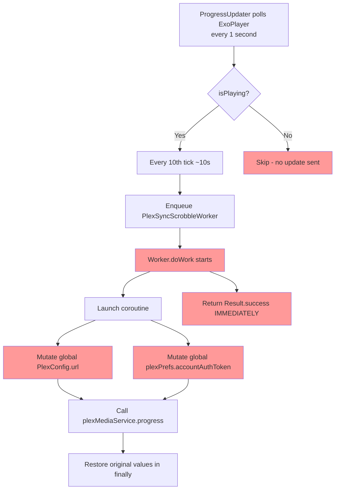
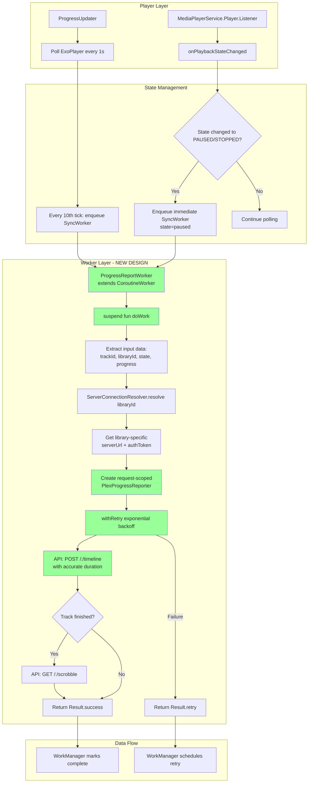
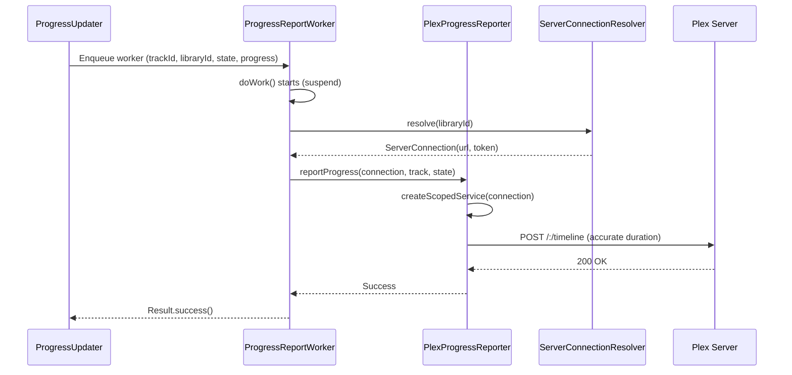

# Progress Reporting Overhaul - Architecture Design

**Status:** Design Document  
**Created:** 2026-02-25  
**Author:** Architecture Team  
**Related Issues:** Worker Bug, Race Condition, Pause State, Duration Hack, Library-Aware Sessions

## Executive Summary

This document proposes a comprehensive overhaul of Chronicle's progress reporting system to Plex servers. The current implementation has critical bugs including race conditions in multi-library setups, missing pause state reporting, and a workaround that reports inaccurate progress to Plex (the "duration * 2 hack").

**Key Goals:**
1. Fix race condition in multi-library progress reporting
2. Migrate from `Worker` to `CoroutineWorker` for proper async handling
3. Report pause state immediately to Plex
4. Remove duration hack and report accurate progress
5. Make `startMediaSession()` library-aware
6. Add retry logic for network failures
7. Improve test coverage

## Current Architecture

### Progress Reporting Pipeline



### Issues Identified

#### 1. **Worker Bug** (Lines 35-146 of PlexSyncScrobbleWorker.kt)
```kotlin
class PlexSyncScrobbleWorker(...) : Worker(...) {  // ❌ Should be CoroutineWorker
    override fun doWork(): Result {
        workerScope.launch {  // ❌ Launches coroutine
            // ... async work ...
        }
        return Result.success()  // ❌ Returns BEFORE coroutine completes!
    }
}
```

**Problem:** The worker returns `Result.success()` immediately, before the API call completes. WorkManager thinks the work succeeded even if it failed.

#### 2. **Race Condition** (Lines 70-138 of PlexSyncScrobbleWorker.kt)
```kotlin
val originalUrl = plexConfig.url
val originalAuthToken = plexPrefs.accountAuthToken
try {
    plexConfig.url = connection.serverUrl ?: originalUrl  // ❌ GLOBAL STATE MUTATION
    plexPrefs.accountAuthToken = connection.authToken ?: originalAuthToken  // ❌ NOT THREAD-SAFE
    
    // API calls using global plexMediaService
    plexMediaService.progress(...)
} finally {
    plexConfig.url = originalUrl  // ❌ Restore in finally
    plexPrefs.accountAuthToken = originalAuthToken
}
```

**Problem:** Two workers for different libraries running concurrently will corrupt each other's API calls. Worker A might send its progress to Worker B's server.

#### 3. **No Pause State Reporting** (Lines 127-137 of ProgressUpdater.kt)
```kotlin
if (isPlaying) {  // ❌ Only sends updates when playing
    updateProgress(...)
}
```

**Problem:** When playback pauses, no `state=paused` timeline update is sent to Plex. The "Now Playing" dashboard shows stale state.

#### 4. **Duration Hack** (Lines 94-98 of PlexSyncScrobbleWorker.kt)
```kotlin
// IMPORTANT: Plex normally marks as finished at 90% progress, but it
// calculates progress with respect to duration provided if a duration is
// provided, so passing duration = actualDuration * 2 causes Plex to never
// automatically mark as finished
duration = track.duration * 2,  // ❌ Reports 50% of actual progress
```

**Problem:** Plex dashboard shows ~50% progress when user is actually at ~100%. User experience is confusing.

#### 5. **Library-Unaware startMediaSession** (Lines 860-862 of AudiobookMediaSessionCallback.kt)
```kotlin
Injector.get().plexMediaService().startMediaSession(
    getMediaItemUri(serverId, bookId),  // Uses global plexPrefsRepo.server?.serverId
)
```

**Problem:** Uses globally-injected `plexMediaService` which sends to the wrong server in multi-library setups.

#### 6. **No Retry Logic** (Lines 103-105 of PlexSyncScrobbleWorker.kt)
```kotlin
try {
    plexMediaService.progress(...)
} catch (t: Throwable) {
    Timber.e("Failed to sync progress: ${t.message}")  // ❌ Just logs, no retry
}
```

**Problem:** Temporary network failures silently fail. Progress is lost.

#### 7. **Minimal Test Coverage**
Only basic data model tests exist. No tests verify:
- API call parameters
- Worker behavior
- Retry logic
- Multi-library scenarios

## Proposed Architecture

### Overview Diagram



### 1. CoroutineWorker Migration

**Design: Migrate PlexSyncScrobbleWorker to CoroutineWorker**

```kotlin
/**
 * Reports playback progress to Plex server using library-aware connections.
 * 
 * Migrated from Worker to CoroutineWorker to properly handle suspend functions
 * and return Result only after async work completes.
 * 
 * @see docs/architecture/progress-reporting-overhaul.md
 */
class ProgressReportWorker(
    context: Context,
    workerParameters: WorkerParameters,
) : CoroutineWorker(context, workerParameters) {  // ✅ Extends CoroutineWorker
    
    // Inject dependencies via Injector.get() (no change)
    private val trackRepository = Injector.get().trackRepo()
    private val bookRepository = Injector.get().bookRepo()
    private val serverConnectionResolver = Injector.get().serverConnectionResolver()
    private val progressReporter = Injector.get().progressReporter()
    
    /**
     * Executes progress reporting with proper async handling.
     * Returns only after all API calls complete or fail.
     */
    override suspend fun doWork(): Result {  // ✅ suspend fun - no manual coroutine
        // Early auth check
        if (!isAuthenticated()) {
            return Result.failure()
        }
        
        // Extract input data
        val trackId = inputData.requireString(TRACK_ID_ARG)
        val playbackState = inputData.requireString(TRACK_STATE_ARG)
        val trackProgress = inputData.requireLong(TRACK_POSITION_ARG)
        val bookProgress = inputData.requireLong(BOOK_PROGRESS_ARG)
        
        // Fetch track and book data
        val track = trackRepository.getTrackAsync(trackId) ?: return Result.failure()
        val bookId = track.parentKey
        val book = bookRepository.getAudiobookAsync(bookId) ?: return Result.failure()
        val tracks = trackRepository.getTracksForAudiobookAsync(bookId)
        
        // Resolve library-specific server connection
        val connection = try {
            serverConnectionResolver.resolve(book.libraryId)
        } catch (e: Exception) {
            Timber.e(e, "Failed to resolve server for library: ${book.libraryId}")
            return Result.retry()  // ✅ Retry on transient errors
        }
        
        Timber.d(
            "Reporting progress for book: ${book.title} in library: ${book.libraryId} " +
            "to server: ${connection.serverUrl}, state: $playbackState"
        )
        
        // Report progress using library-specific connection
        return try {
            progressReporter.reportProgress(
                connection = connection,
                track = track,
                book = book,
                tracks = tracks,
                trackProgress = trackProgress,
                bookProgress = bookProgress,
                playbackState = playbackState,
            )
            
            Result.success()  // ✅ Only returns after API call completes
        } catch (e: Exception) {
            Timber.e(e, "Failed to report progress")
            Result.retry()  // ✅ WorkManager will retry with backoff
        }
    }
    
    private fun isAuthenticated(): Boolean {
        val plexPrefs = Injector.get().plexPrefs()
        val authToken = plexPrefs.user?.authToken ?: plexPrefs.accountAuthToken
        return authToken.isNotEmpty()
    }
    
    companion object {
        const val TRACK_ID_ARG = "Track ID"
        const val TRACK_STATE_ARG = "State"
        const val TRACK_POSITION_ARG = "Track position"
        const val BOOK_PROGRESS_ARG = "Book progress"
        
        fun makeWorkerData(
            trackId: String,
            playbackState: String,
            trackProgress: Long,
            bookProgress: Long,
        ): Data {
            require(trackId != TRACK_NOT_FOUND)
            return workDataOf(
                TRACK_ID_ARG to trackId,
                TRACK_POSITION_ARG to trackProgress,
                TRACK_STATE_ARG to playbackState,
                BOOK_PROGRESS_ARG to bookProgress,
            )
        }
    }
}
```

**Key Changes:**
- Extends `CoroutineWorker` instead of `Worker`
- `doWork()` is now `suspend fun` - no manual coroutine creation
- Returns `Result` only after async work completes
- Returns `Result.retry()` on transient failures for WorkManager retry

### 2. Library-Aware API Calls (Race Condition Fix)

**Design: Request-Scoped Retrofit Instance**

Create a new `PlexProgressReporter` class that creates request-scoped Retrofit instances:

```kotlin
/**
 * Reports playback progress to Plex servers with library-aware routing.
 * 
 * Creates request-scoped Retrofit instances to avoid global state mutation.
 * Each progress report uses the correct server URL and auth token for the library.
 * 
 * @see ServerConnectionResolver
 */
@Singleton
class PlexProgressReporter @Inject constructor(
    private val plexConfig: PlexConfig,
    private val retryHandler: RetryHandler,
) {
    /**
     * Reports progress to Plex using library-specific connection.
     * 
     * @param connection Library-specific server URL and auth token
     * @param track The track being played
     * @param book The audiobook containing the track
     * @param tracks All tracks in the audiobook
     * @param trackProgress Current position in track (ms)
     * @param bookProgress Current position in book (ms)
     * @param playbackState Plex state: "playing", "paused", or "stopped"
     */
    suspend fun reportProgress(
        connection: ServerConnection,
        track: MediaItemTrack,
        book: Audiobook,
        tracks: List<MediaItemTrack>,
        trackProgress: Long,
        bookProgress: Long,
        playbackState: String,
    ) {
        // Create request-scoped PlexMediaService with library-specific base URL
        val service = createScopedService(connection)
        
        // Extract numeric IDs for API calls
        val numericTrackId = track.id.removePrefix("plex:").toIntOrNull()
            ?: throw IllegalArgumentException("Invalid track ID: ${track.id}")
        val numericBookId = book.id.removePrefix("plex:").toIntOrNull()
            ?: throw IllegalArgumentException("Invalid book ID: ${book.id}")
        
        // Report timeline progress with retry
        withRetry(
            config = RetryConfig.DEFAULT,
            shouldRetry = { error -> isRetryableError(error) },
            onRetry = { attempt, delay, error ->
                Timber.w("Progress report attempt $attempt failed, retrying in ${delay}ms: ${error.message}")
            },
        ) {
            service.progress(
                ratingKey = numericTrackId.toString(),
                offset = trackProgress.toString(),
                playbackTime = trackProgress,
                playQueueItemId = track.playQueueItemID,
                key = "${MediaItemTrack.PARENT_KEY_PREFIX}$numericTrackId",
                duration = track.duration,  // ✅ ACCURATE duration, no * 2 hack
                playState = playbackState,
                hasMde = 1,
            )
            Timber.i("Synced progress for ${book.title}: $playbackState at ${trackProgress}ms")
        }
        
        // Mark track as watched if finished
        val isTrackFinished = trackProgress > track.duration - 1000  // Within 1 second
        if (isTrackFinished) {
            withRetry(
                config = RetryConfig.DEFAULT,
                shouldRetry = { error -> isRetryableError(error) },
            ) {
                service.watched(numericTrackId.toString())
                Timber.i("Marked track watched: ${track.title}")
            }
        }
        
        // Mark book as watched if finished (using accurate progress)
        val isBookFinished = isBookCompleted(bookProgress, tracks.getDuration(), playbackState)
        if (isBookFinished) {
            withRetry(
                config = RetryConfig.DEFAULT,
                shouldRetry = { error -> isRetryableError(error) },
            ) {
                service.watched(numericBookId.toString())
                Timber.i("Marked book watched: ${book.title}")
            }
        }
    }
    
    /**
     * Creates a library-scoped PlexMediaService with specific base URL and auth token.
     * This instance is used only for this request and discarded after.
     */
    private fun createScopedService(connection: ServerConnection): PlexMediaService {
        val baseUrl = connection.serverUrl ?: throw IllegalStateException("No server URL")
        val authToken = connection.authToken ?: throw IllegalStateException("No auth token")
        
        // Create OkHttp client with request-scoped interceptor
        val client = OkHttpClient.Builder()
            .addInterceptor(createScopedInterceptor(authToken))
            .connectTimeout(30, TimeUnit.SECONDS)
            .readTimeout(30, TimeUnit.SECONDS)
            .writeTimeout(30, TimeUnit.SECONDS)
            .build()
        
        // Create Retrofit instance with library-specific base URL
        val retrofit = Retrofit.Builder()
            .baseUrl(baseUrl)
            .client(client)
            .addConverterFactory(MoshiConverterFactory.create())
            .build()
        
        return retrofit.create(PlexMediaService::class.java)
    }
    
    /**
     * Creates an OkHttp interceptor with request-scoped auth token.
     * Similar to PlexInterceptor but uses provided token instead of global state.
     */
    private fun createScopedInterceptor(authToken: String): Interceptor {
        return Interceptor { chain ->
            val request = chain.request().newBuilder()
                .header("Accept", "application/json")
                .header("X-Plex-Platform", "Android")
                .header("X-Plex-Provides", "player")
                .header("X-Plex-Client-Identifier", plexConfig.sessionIdentifier)
                .header("X-Plex-Version", BuildConfig.VERSION_NAME)
                .header("X-Plex-Product", "Chronicle")
                .header("X-Plex-Device-Name", Build.MODEL)
                .header("X-Plex-Token", authToken)  // ✅ Request-scoped token
                .build()
            
            chain.proceed(request)
        }
    }
    
    /**
     * Determines if book is completed based on accurate progress.
     * Called ONLY when playback pauses/stops to avoid auto-marking during playback.
     */
    private fun isBookCompleted(
        bookProgress: Long,
        bookDuration: Long,
        playbackState: String,
    ): Boolean {
        // Only consider book finished when user explicitly pauses/stops near the end
        val isNearEnd = bookDuration - bookProgress < BOOK_FINISHED_END_OFFSET_MILLIS
        val hasUserStopped = playbackState == PLEX_STATE_PAUSED || playbackState == PLEX_STATE_STOPPED
        return isNearEnd && hasUserStopped
    }
    
    /**
     * Determines if an error is transient and should be retried.
     */
    private fun isRetryableError(error: Throwable): Boolean {
        return when (error) {
            is SocketTimeoutException,
            is UnknownHostException,
            is ConnectException,
            is IOException -> true
            is HttpException -> error.code() in 500..599  // Server errors are retryable
            else -> false
        }
    }
}
```

**Key Design Decisions:**

1. **Request-Scoped Retrofit Instance**: Create a new Retrofit instance for each request with the correct base URL and auth token. This eliminates global state mutation.

2. **No Global State Mutation**: Never mutate `plexConfig.url` or `plexPrefs.accountAuthToken`. Each request gets its own instance.

3. **Thread-Safe**: Multiple workers can run concurrently without interfering with each other.

4. **ServerConnectionResolver Integration**: Leverage existing `ServerConnectionResolver` to get library-specific connections.

### 3. Pause State Reporting

**Design: Hook into ExoPlayer.Listener for Immediate State Changes**

Modify `MediaPlayerService` to send immediate updates when playback state changes:

```kotlin
// In MediaPlayerService.kt

private val playerListener = object : Player.Listener {
    override fun onPlaybackStateChanged(playbackState: Int) {
        when (playbackState) {
            Player.STATE_ IDLE,
            Player.STATE_ENDED -> {
                // Handle end of playback
            }
        }
    }
    
    override fun onIsPlayingChanged(isPlaying: Boolean) {
        Timber.d("Player isPlaying changed to: $isPlaying")
        
        // Update PlaybackStateController
        serviceScope.launch {
            playbackStateController.updatePlayingState(isPlaying)
        }
        
        // Send immediate progress update to Plex when pausing/stopping
        if (!isPlaying) {
            sendImmediateProgressUpdate(PLEX_STATE_PAUSED)
        }
    }
}

/**
 * Sends an immediate progress update to Plex without waiting for the next poll.
 * Used when playback pauses or stops to ensure Plex dashboard shows current state.
 */
private fun sendImmediateProgressUpdate(plexState: String) {
    val currentTrack = mediaController.metadata?.id ?: return
    
    // Get current position
    val absolutePositionFromExtras = mediaController.playbackState?.extras
        ?.getLong(EXTRA_ABSOLUTE_TRACK_POSITION) ?: 0L
    val chapterRelativePosition = mediaController.playbackState?.currentPlayBackPosition ?: 0L
    val chapter = currentlyPlaying.chapter.value
    
    val playerPosition = if (chapter != EMPTY_CHAPTER && chapterRelativePosition >= 0) {
        chapter.startTimeOffset + chapterRelativePosition
    } else {
        absolutePositionFromExtras
    }
    
    // Force immediate network update (forceNetworkUpdate = true)
    progressUpdater.updateProgress(
        trackId = currentTrack,
        playbackState = plexState,
        progress = playerPosition,
        forceNetworkUpdate = true,  // ✅ Bypass 10-tick counter
    )
    
    Timber.i("Sent immediate progress update to Plex: state=$plexState, position=${playerPosition}ms")
}

// Register listener in onCreate()
override fun onCreate() {
    super.onCreate()
    // ... existing setup ...
    exoPlayer.addListener(playerListener)
}

override fun onDestroy() {
    exoPlayer.removeListener(playerListener)
    super.onDestroy()
}
```

**Alternative Approach: Modify ProgressUpdater to Always Send State**

```kotlin
// In SimpleProgressUpdater.kt

override fun startRegularProgressUpdates() {
    requireNotNull(mediaController).let { controller ->
        val playerPosition = calculatePlayerPosition(controller)
        val isPlaying = controller.playbackState?.isPlaying != false
        val plexState = if (isPlaying) PLEX_STATE_PLAYING else PLEX_STATE_PAUSED
        
        // ✅ Always update, even when paused (to keep state fresh)
        serviceScope.launch(context = serviceScope.coroutineContext + Dispatchers.IO) {
            updateProgress(
                controller.metadata?.id ?: TRACK_NOT_FOUND,
                plexState,  // ✅ Send correct state
                playerPosition,
                false,
            )
        }
    }
    handler.postDelayed(updateProgressAction, updateProgressFrequencyMs)
}
```

**Recommendation:** Use **MediaPlayerService listener approach** for immediate pause detection + continue polling for playing state. This ensures:
- Immediate `state=paused` update when user pauses
- Continued polling during playback for accurate position updates
- No redundant updates when already paused

### 4. Duration Hack Replacement

**Problem Analysis:**

Plex marks items as "watched" when progress reaches 90% of duration. The current hack reports `duration * 2` to prevent this, but causes Plex to show ~50% progress.

**Proposed Solution: Manage "Watched" Status Ourselves**

**Option A: Report Accurate Duration + Control Watched Calls**

```kotlin
// In PlexProgressReporter.reportProgress()

service.progress(
    ratingKey = numericTrackId.toString(),
    offset = trackProgress.toString(),
    key = "${MediaItemTrack.PARENT_KEY_PREFIX}$numericTrackId",
    duration = track.duration,  // ✅ ACCURATE duration (no * 2)
    playState = playbackState,
    hasMde = 1,
)

// Manage "watched" state ourselves based on our own threshold
val isBookFinished = isBookCompleted(bookProgress, tracks.getDuration(), playbackState)
if (isBookFinished) {
    // Only call watched() when WE determine book is finished
    // Plex's auto-watch at 90% won't matter because we control the call
    service.watched(numericBookId.toString())
}
```

**How this prevents auto-watch:**
- Plex's 90% auto-watch applies to INDIVIDUAL TRACKS, not the book
- We call `watched()` for tracks when they finish (within 1 second of end)
- For the BOOK, we only call `watched()` when user pauses/stops within 2 minutes of end
- This gives Chronicle full control over completion logic

**Option B: Investigate Plex Server Settings**

Research if Plex has a server-side setting to control the 90% threshold:
- Check Plex Web UI → Settings → Library → Advanced
- Check Plex API documentation for playback threshold parameters
- Test if `includeChapters=1` or other params affect auto-watch behavior

**Option C: Different Threshold for Watched Calls**

Use a different threshold than Plex's 90%:

```kotlin
/**
 * Determines if book is completed based on Chronicle's criteria.
 * 
 * Chronicle considers a book finished when:
 * 1. User pauses/stops playback (explicit action)
 * 2. Less than 2 minutes remaining in book
 * 
 * This is more lenient than Plex's 90% rule to account for:
 * - Credits/epilogues user may not want to finish
 * - User preference to mark as done before absolute end
 */
private fun isBookCompleted(
    bookProgress: Long,
    bookDuration: Long,
    playbackState: String,
): Boolean {
    val remainingTime = bookDuration - bookProgress
    val isNearEnd = remainingTime < 2.minutes.inWholeMilliseconds
    val hasUserStopped = playbackState == PLEX_STATE_PAUSED || 
                         playbackState == PLEX_STATE_STOPPED
    
    return isNearEnd && hasUserStopped
}
```

**Recommendation: Option A** - Report accurate duration and manage `watched()` calls ourselves. This gives users accurate progress in Plex dashboard while Chronicle retains control over completion logic.

### 5. Library-Aware startMediaSession()

**Current Implementation:**

```kotlin
// In AudiobookMediaSessionCallback.playBook()
private fun getMediaItemUri(serverId: String, bookId: Int): String {
    return "server://$serverId/com.plexapp.plugins.library/library/metadata/$bookId"
}

plexMediaService.startMediaSession(
    getMediaItemUri(plexPrefsRepo.server?.serverId ?: "", bookId)
)
```

**Problem:** Uses global `plexPrefsRepo.server?.serverId`, which may be wrong server for the book's library.

**Proposed Solution:**

```kotlin
/**
 * Starts a media session on the Plex server for the given book.
 * Uses library-specific server connection to ensure the session is created
 * on the correct server in multi-library setups.
 */
private suspend fun startMediaSessionForBook(book: Audiobook) {
    val bookId = book.id.removePrefix("plex:").toIntOrNull() ?: return
    
    // Resolve library-specific server connection
    val connection = try {
        serverConnectionResolver.resolve(book.libraryId)
    } catch (e: Exception) {
        Timber.e(e, "Failed to resolve server for library: ${book.libraryId}")
        return
    }
    
    // Get server ID from library metadata (stored during sync)
    val serverId = try {
        libraryRepository.getServerId(book.libraryId)
    } catch (e: Exception) {
        Timber.e(e, "Failed to get server ID for library: ${book.libraryId}")
        return
    }
    
    // Create library-scoped service
    val service = progressReporter.createScopedService(connection)
    
    // Start media session with correct server
    try {
        service.startMediaSession(
            uri = "server://$serverId/com.plexapp.plugins.library/library/metadata/$bookId"
        )
        Timber.i("Started media session for ${book.title} on server $serverId")
    } catch (e: Exception) {
        Timber.e(e, "Failed to start media session")
    }
}
```

**Database Schema Addition:**

Add `serverId` to Library table:

```kotlin
// In LibraryRepository.kt
@Entity
data class Library(
    @PrimaryKey val id: String,  // e.g., "plex:library:1"
    val name: String,
    val serverUrl: String?,
    val authToken: String?,
    val serverId: String?,  // ✅ NEW: Machine identifier for server URIs
    val accountId: String,
)
```

Store `serverId` during library sync from `PlexServer.machineIdentifier` field.

### 6. Retry Strategy

**Design: Leverage Existing RetryHandler + WorkManager Backoff**

Chronicle already has `RetryHandler.kt` with exponential backoff. Combine this with WorkManager's built-in retry:

```kotlin
// In ProgressReportWorker.doWork()
override suspend fun doWork(): Result {
    return try {
        // ... fetch data ...
        
        // Report with retry using RetryHandler
        progressReporter.reportProgress(
            connection = connection,
            track = track,
            book = book,
            tracks = tracks,
            trackProgress = trackProgress,
            bookProgress = bookProgress,
            playbackState = playbackState,
        )
        
        Result.success()
    } catch (e: Exception) {
        when (e) {
            is SocketTimeoutException,
            is UnknownHostException,
            is ConnectException,
            is IOException -> {
                Timber.w(e, "Transient network error, will retry")
                Result.retry()  // ✅ Let WorkManager retry with backoff
            }
            else -> {
                Timber.e(e, "Non-retryable error")
                Result.failure()
            }
        }
    }
}
```

**WorkManager Retry Configuration:**

```kotlin
// In SimpleProgressUpdater.updateNetworkProgress()
val worker = OneTimeWorkRequestBuilder<ProgressReportWorker>()
    .setInputData(inputData)
    .setConstraints(syncWorkerConstraints)
    .setBackoffCriteria(
        BackoffPolicy.EXPONENTIAL,  // ✅ Exponential backoff
        WorkRequest.MIN_BACKOFF_MILLIS,  // Start at 10 seconds
        TimeUnit.MILLISECONDS,
    )
    .build()
```

**Retry Behavior:**

1. **RetryHandler within reportProgress()**: Retries individual API calls (progress, watched) with exponential backoff (1s, 2s, 4s...)
2. **WorkManager retry**: If entire worker fails, WorkManager retries the whole job (10s, 20s, 40s...)
3. **Combined effect**: Fast retries for transient failures, slow retries for persistent issues

**Retry Config Recommendations:**

```kotlin
// In PlexProgressReporter.kt
companion object {
    val PROGRESS_RETRY_CONFIG = RetryConfig(
        maxAttempts = 3,
        initialDelayMs = 1000L,   // 1 second
        maxDelayMs = 5000L,       // Max 5 seconds
        multiplier = 2.0,
    )
}
```

### 7. Testing Strategy

**Test Structure:**

```
app/src/test/java/local/oss/chronicle/
└── data/sources/plex/
    ├── ProgressReportWorkerTest.kt          # ✅ NEW: Worker behavior
    ├── PlexProgressReporterTest.kt          # ✅ NEW: Progress reporting logic
    ├── ServerConnectionResolverTest.kt      # ✅ EXISTING: Multi-library routing
    └── ProgressReportIntegrationTest.kt     # ✅ NEW: End-to-end scenarios
```

#### Test 1: ProgressReportWorkerTest.kt

```kotlin
@RunWith(MockitoJUnitRunner::class)
class ProgressReportWorkerTest {
    
    @Mock lateinit var context: Context
    @Mock lateinit var workerParameters: WorkerParameters
    @Mock lateinit var trackRepository: ITrackRepository
    @Mock lateinit var bookRepository: IBookRepository
    @Mock lateinit var serverConnectionResolver: ServerConnectionResolver
    @Mock lateinit var progressReporter: PlexProgressReporter
    
    @Test
    fun `doWork returns success when progress report succeeds`() = runTest {
        // Given: Valid track and book data
        val trackId = "plex:123"
        val track = TestFixtures.createTrack(id = trackId, libraryId = "plex:library:1")
        val book = TestFixtures.createBook(id = "plex:456", libraryId = "plex:library:1")
        val connection = ServerConnection("http://server:32400", "token123")
        
        whenever(trackRepository.getTrackAsync(trackId)).thenReturn(track)
        whenever(bookRepository.getAudiobookAsync(any())).thenReturn(book)
        whenever(serverConnectionResolver.resolve(any())).thenReturn(connection)
        
        val inputData = ProgressReportWorker.makeWorkerData(
            trackId = trackId,
            playbackState = "playing",
            trackProgress = 60000L,
            bookProgress = 120000L,
        )
        
        // When: Worker executes
        val worker = ProgressReportWorker(context, workerParameters)
        val result = worker.doWork()
        
        // Then: Returns success
        assertThat(result).isEqualTo(Result.success())
        
        // And: Progress reporter was called
        verify(progressReporter).reportProgress(
            connection = connection,
            track = track,
            book = book,
            tracks = any(),
            trackProgress = 60000L,
            bookProgress = 120000L,
            playbackState = "playing",
        )
    }
    
    @Test
    fun `doWork returns retry when network error occurs`() = runTest {
        // Given: Network error when resolving connection
        whenever(serverConnectionResolver.resolve(any()))
            .thenThrow(SocketTimeoutException("Network timeout"))
        
        // When: Worker executes
        val result = worker.doWork()
        
        // Then: Returns retry
        assertThat(result).isEqualTo(Result.retry())
    }
    
    @Test
    fun `doWork returns failure when authentication missing`() = runTest {
        // Given: No auth token
        Injector.get().plexPrefs().accountAuthToken = ""
        
        // When: Worker executes
        val result = worker.doWork()
        
        // Then: Returns failure (no point retrying)
        assertThat(result).isEqualTo(Result.failure())
    }
}
```

#### Test 2: PlexProgressReporterTest.kt

```kotlin
@RunWith(MockitoJUnitRunner::class)
class PlexProgressReporterTest {
    
    @Mock lateinit var plexMediaService: PlexMediaService
    @Mock lateinit var plexConfig: PlexConfig
    
    private lateinit var reporter: PlexProgressReporter
    
    @Test
    fun `reportProgress calls progress endpoint with accurate duration`() = runTest {
        // Given: Valid track and book
        val track = TestFixtures.createTrack(duration = 3600000L)  // 1 hour
        val connection = ServerConnection("http://server:32400", "token123")
        
        // When: Reporting progress
        reporter.reportProgress(
            connection = connection,
            track = track,
            book = book,
            tracks = listOf(track),
            trackProgress = 1800000L,  // 30 minutes
            bookProgress = 1800000L,
            playbackState = "playing",
        )
        
        // Then: API called with ACCURATE duration (not * 2)
        verify(plexMediaService).progress(
            ratingKey = "123",
            offset = "1800000",
            duration = 3600000L,  // ✅ NOT 7200000L
            playState = "playing",
            hasMde = 1,
        )
    }
    
    @Test
    fun `reportProgress marks track watched when within 1 second of end`() = runTest {
        // Given: Track nearly finished
        val track = TestFixtures.createTrack(id = "plex:123", duration = 60000L)
        val trackProgress = 59500L  // Within 1 second of end
        
        // When: Reporting progress
        reporter.reportProgress(...)
        
        // Then: Watched endpoint called for track
        verify(plexMediaService).watched("123")
    }
    
    @Test
    fun `reportProgress marks book watched when paused near end`() = runTest {
        // Given: Book nearly finished and user paused
        val bookDuration = 3600000L  // 1 hour
        val bookProgress = 3480000L  // 58 minutes (within 2-minute threshold)
        
        // When: Reporting progress with paused state
        reporter.reportProgress(
            trackProgress = 1800000L,
            bookProgress = bookProgress,
            playbackState = "paused",  // ✅ User explicitly paused
        )
        
        // Then: Watched endpoint called for book
        verify(plexMediaService).watched("456")
    }
    
    @Test
    fun `reportProgress does NOT mark book watched when playing near end`() = runTest {
        // Given: Book nearly finished but still playing
        val bookProgress = 3480000L  // Within threshold
        
        // When: Reporting progress while playing
        reporter.reportProgress(
            bookProgress = bookProgress,
            playbackState = "playing",  // ✅ Still playing
        )
        
        // Then: Watched NOT called (wait for user to pause)
        verify(plexMediaService, never()).watched(any())
    }
    
    @Test
    fun `reportProgress retries on network timeout`() = runTest {
        // Given: First call times out, second succeeds
        whenever(plexMediaService.progress(any(), any(), any(), any(), any(), any()))
            .thenThrow(SocketTimeoutException())
            .thenReturn(Unit)
        
        // When: Reporting progress
        reporter.reportProgress(...)
        
        // Then: API called twice (retry worked)
        verify(plexMediaService, times(2)).progress(any(), any(), any(), any(), any(), any())
    }
}
```

#### Test 3: Multi-Library Concurrent Workers Test

```kotlin
@Test
fun `concurrent workers for different libraries do not interfere`() = runTest {
    // Given: Two books from different libraries
    val book1 = TestFixtures.createBook(libraryId = "plex:library:1")
    val book2 = TestFixtures.createBook(libraryId = "plex:library:2")
    val connection1 = ServerConnection("http://server1:32400", "token1")
    val connection2 = ServerConnection("http://server2:32400", "token2")
    
    whenever(serverConnectionResolver.resolve("plex:library:1")).thenReturn(connection1)
    whenever(serverConnectionResolver.resolve("plex:library:2")).thenReturn(connection2)
    
    // When: Two workers run concurrently
    val worker1 = async { createWorker(book1).doWork() }
    val worker2 = async { createWorker(book2).doWork() }
    
    val result1 = worker1.await()
    val result2 = worker2.await()
    
    // Then: Both succeed
    assertThat(result1).isEqualTo(Result.success())
    assertThat(result2).isEqualTo(Result.success())
    
    // And: Each used correct server (no cross-contamination)
    verify(service1).progress(/* book1 params */)
    verify(service2).progress(/* book2 params */)
}
```

### 8. Migration Plan

**Phase 1: Foundation (Week 1)**
- [ ] Create `PlexProgressReporter` class with request-scoped Retrofit instances
- [ ] Add `serverId` field to Library table with migration
- [ ] Write unit tests for `PlexProgressReporter`
- [ ] Test with single-library setup (backward compatibility)

**Phase 2: Worker Migration (Week 1-2)**
- [ ] Rename `PlexSyncScrobbleWorker` → `ProgressReportWorker`
- [ ] Migrate from `Worker` to `CoroutineWorker`
- [ ] Update `doWork()` to use `PlexProgressReporter`
- [ ] Remove global state mutations
- [ ] Write unit tests for `ProgressReportWorker`
- [ ] Integration test: Compare old vs new worker behavior

**Phase 3: Pause State Reporting (Week 2)**
- [ ] Add `ExoPlayer.Listener` to `MediaPlayerService`
- [ ] Implement `sendImmediateProgressUpdate()` on pause/stop
- [ ] Test pause state shows immediately in Plex dashboard
- [ ] Verify no duplicate updates

**Phase 4: Duration Hack Removal (Week 2-3)**
- [ ] Remove `duration * 2` from progress calls
- [ ] Implement `isBookCompleted()` logic for book-level watched calls
- [ ] Test with various book completion scenarios
- [ ] Verify Plex dashboard shows accurate progress
- [ ] Monitor for any auto-watch issues

**Phase 5: Library-Aware startMediaSession (Week 3)**
- [ ] Modify `startMediaSessionForBook()` to use `ServerConnectionResolver`
- [ ] Store `serverId` during library sync
- [ ] Test media session creation in multi-server setup
- [ ] Verify "Now Playing" shows on correct server

**Phase 6: Retry Logic (Week 3)**
- [ ] Configure retry behavior in worker creation
- [ ] Test retry scenarios (network timeout, server error, etc.)
- [ ] Add telemetry/logging for retry attempts
- [ ] Document retry behavior

**Phase 7: Testing & Validation (Week 4)**
- [ ] Complete all unit tests
- [ ] Write integration tests
- [ ] Manual testing with multi-library setup
- [ ] Load testing: Concurrent workers for different libraries
- [ ] Regression testing: Existing playback scenarios

**Phase 8: Deployment & Monitoring (Week 4+)**
- [ ] Deploy to beta testers with multi-library setups
- [ ] Monitor logs for errors/retries
- [ ] Collect feedback on Plex dashboard accuracy
- [ ] Fix any edge cases discovered
- [ ] Update AGENT.md and architecture docs

### Backward Compatibility

**Considerations:**
1. **Single-Library Setups**: Must continue working without changes
2. **Database Migration**: Add `serverId` field without breaking existing data
3. **Global PlexConfig**: Keep as fallback when library has no serverUrl
4. **Existing Workers**: Old worker requests in WorkManager queue must be handled gracefully

**Migration Strategy:**
```kotlin
// Database migration
val MIGRATION_X_Y = object : Migration(X, Y) {
    override fun migrate(database: SupportSQLiteDatabase) {
        // Add serverId column (nullable for backward compatibility)
        database.execSQL("ALTER TABLE Library ADD COLUMN serverId TEXT")
    }
}

// ServerConnectionResolver fallback
suspend fun resolve(libraryId: String): ServerConnection {
    val dbConnection = libraryRepository.getServerConnection(libraryId)
    
    // Fallback to global PlexConfig if library has no connection
    val serverUrl = dbConnection?.serverUrl ?: plexConfig.url
    val authToken = dbConnection?.authToken ?: plexPrefsRepo.accountAuthToken
    
    return ServerConnection(serverUrl, authToken)
}
```

### Performance Considerations

**Request-Scoped Retrofit Instances:**
- **Overhead**: Creating Retrofit instance per request adds ~1ms overhead
- **Benefit**: Thread-safe, no global state, scales to unlimited concurrent libraries
- **Mitigation**: 1ms is negligible compared to network latency (100-1000ms)

**Database Writes:**
- **Current**: Debounced to 3 seconds (PlaybackStateController)
- **New**: No change - same debounce strategy
- **Impact**: Minimal

**Worker Frequency:**
- **Current**: Every 10 seconds when playing
- **New**: Same, plus immediate update on pause
- **Impact**: Slight increase, but only 1 extra request per pause event

## Risk Assessment

| Risk | Severity | Mitigation |
|------|----------|------------|
| Break existing single-library setups | High | Extensive backward compatibility testing |
| Retrofit instance creation overhead | Low | Measure performance, cache if needed |
| WorkManager retry storm in offline mode | Medium | Use exponential backoff, max attempts |
| Plex auto-watch still triggers at 90% | Medium | Test thoroughly, document behavior |
| Database migration failure | High | Test migration with real user data |

## Success Metrics

1. **No Race Conditions**: Concurrent workers for different libraries report to correct servers 100% of the time
2. **Pause State Accuracy**: Plex dashboard shows "paused" state within 2 seconds of user pausing
3. **Duration Accuracy**: Plex dashboard shows progress within 5% of actual progress
4. **Retry Success Rate**: >95% of transient failures recover via retry
5. **Backward Compatibility**: Zero regressions for single-library users

## Open Questions

1. **Plex Auto-Watch Behavior**: Does reporting accurate duration cause Plex to auto-mark at 90%? Needs testing.
   - **Resolution**: Test with real Plex server, document actual behavior

2. **Server ID Storage**: Where to get `serverId` for `startMediaSession` URI?
   - **Resolution**: Store `PlexServer.machineIdentifier` in Library table during sync

3. **WorkManager Queue Migration**: What happens to old `PlexSyncScrobbleWorker` jobs in queue?
   - **Resolution**: Let them fail gracefully, new jobs use new worker class

4. **Retry Limits**: Should we have a max retry count per day to avoid battery drain?
   - **Resolution**: Use WorkManager's built-in limits (backoff caps at 5 hours)

## References

- [`PlexSyncScrobbleWorker.kt`](../../app/src/main/java/local/oss/chronicle/data/sources/plex/PlexSyncScrobbleWorker.kt) - Current implementation
- [`ServerConnectionResolver.kt`](../../app/src/main/java/local/oss/chronicle/data/sources/plex/ServerConnectionResolver.kt) - Library-aware routing
- [`RetryHandler.kt`](../../app/src/main/java/local/oss/chronicle/util/RetryHandler.kt) - Existing retry utility
- [`ProgressUpdater.kt`](../../app/src/main/java/local/oss/chronicle/features/player/ProgressUpdater.kt) - Progress polling
- [`PlaybackStateController.kt`](../../app/src/main/java/local/oss/chronicle/features/player/PlaybackStateController.kt) - State management
- [WorkManager Documentation](https://developer.android.com/topic/libraries/architecture/workmanager)
- [Retrofit Documentation](https://square.github.io/retrofit/)

## Appendix: Code Snippets

### Worker Registration

```kotlin
// In AppModule.kt or ServiceModule.kt
@Provides
@Singleton
fun providePlexProgressReporter(
    plexConfig: PlexConfig,
): PlexProgressReporter {
    return PlexProgressReporter(plexConfig)
}
```

### Example API Call Flow



---

**Document Status:** Ready for Review  
**Next Steps:**  
1. Team review and feedback
2. Spike: Test Plex auto-watch behavior with accurate duration
3. Create implementation tickets based on migration plan
4. Update project roadmap
