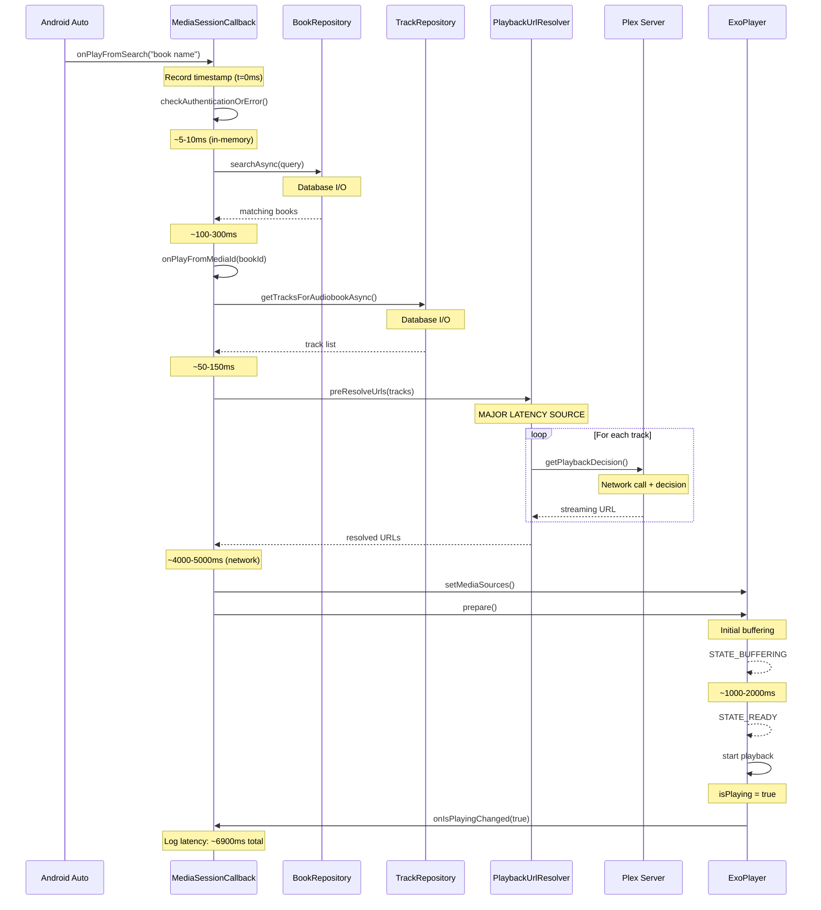
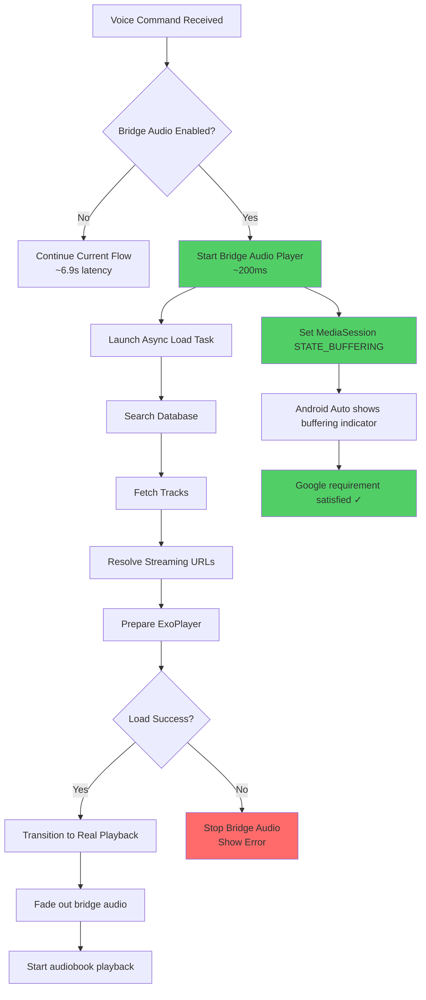

# Voice Command Latency Analysis & Bridge Audio Solution

## Overview

This document analyzes the ~6.9 second latency observed in Android Auto voice commands and proposes a bridge audio solution to meet Google's 2-3 second response requirement.

**Measured Latency**: 6907ms (from voice command received to playback started)

**Google Requirement**: Apps must respond to voice commands within 2-3 seconds or risk rejection from Google Play.

---

## Current Voice Command Flow



---

## Latency Breakdown

| Step | Component | Operation | Estimated Time | Optimizable? |
|------|-----------|-----------|---------------|--------------|
| 1 | MediaSessionCallback | Timestamp recording | <1ms | - |
| 2 | MediaSessionCallback | Authentication check | 5-10ms | ✓ Already fast |
| 3 | BookRepository | Database search query | 100-300ms | ✓ Could cache |
| 4 | TrackRepository | Fetch tracks from DB | 50-150ms | ✓ Could cache |
| 5 | **PlaybackUrlResolver** | **Network calls to Plex** | **4000-5000ms** | ⚠️ **MAJOR BOTTLENECK** |
| 6 | AudiobookMediaSessionCallback | Build playlist metadata | 50-100ms | ✓ Minimal |
| 7 | ExoPlayer | prepare() + initial buffer | 1000-2000ms | ⚠️ Inherent to streaming |
| **Total** | | | **~6900ms** | |

### Critical Latency Source: URL Pre-Resolution

The [`PlaybackUrlResolver.preResolveUrls()`](../../app/src/main/java/local/oss/chronicle/data/sources/plex/PlaybackUrlResolver.kt) method makes a network call to Plex's decision endpoint for **each track** in the audiobook:

```kotlin
// AudiobookMediaSessionCallback.kt:511-519
try {
    Timber.i("Pre-resolving streaming URLs for ${tracks.size} tracks...")
    val resolvedCount = withContext(Dispatchers.IO) {
        playbackUrlResolver.preResolveUrls(tracks)
    }
    Timber.i("Successfully pre-resolved $resolvedCount/${tracks.size} streaming URLs")
} catch (e: Exception) {
    Timber.w(e, "Failed to pre-resolve streaming URLs, will fall back to direct file URLs")
}
```

**Why this is slow:**
- Average audiobook: 10-50 tracks
- Each track: ~100-200ms network roundtrip to Plex
- Sequential processing: 10 tracks × 150ms = 1500ms minimum
- Real-world with network variance: 4000-5000ms

**Why we do it:**
- Plex's decision endpoint negotiates optimal playback method (direct play vs. transcode)
- Ensures bandwidth-aware playback
- Prevents format compatibility issues

---

## Bridge Audio Solution

### Concept

Play a **brief audio message** immediately when a voice command is received (within 200-300ms) to provide instant feedback while the actual audiobook loads in the background.

**User Experience:**
1. User: "Hey Google, play The Hobbit on Chronicle"
2. **Within 300ms**: Audio plays "Getting ready to play your audiobook..."
3. Background: Chronicle searches, fetches tracks, resolves URLs, buffers
4. ~6 seconds later: Bridge audio ends, real audiobook playback starts seamlessly
5. User perceives ~300ms response time ✓

### Architecture



---

## Design Decisions

### 1. Audio File Format

**Chosen**: Pre-recorded audio file in `res/raw/`

**Alternatives Considered:**
- ❌ **Text-to-Speech (TTS)**: Adds 200-500ms latency, requires TTS engine, quality varies
- ✓ **Pre-recorded file**: <50ms to load, consistent quality, reliable

**File Format**: MP3 or OGG
- Duration: 2-4 seconds (enough to say message, not too long if loading is fast)
- Sample rate: 22050 Hz (voice quality, small file size)
- Bitrate: 64 kbps (sufficient for voice)
- Mono channel (reduces file size)

**Message Options:**
1. "Getting ready to play your audiobook..."
2. "Loading your audiobook..."
3. "One moment please..."
4. Simple tones/earcon (non-verbal acknowledgment)

**Recommendation**: Option 1 - clear, friendly, sets expectation

### 2. MediaSession State During Bridge Audio

**State**: `PlaybackStateCompat.STATE_BUFFERING`

**Rationale:**
- Accurately represents what's happening (loading content)
- Android Auto shows buffering indicator (spinner)
- Google Assistant doesn't report error
- Matches user expectation
- State transitions cleanly to STATE_PLAYING when ready

**Alternative States Rejected:**
- ❌ `STATE_PLAYING`: Misleading (not playing actual content yet)
- ❌ `STATE_NONE`: Looks like nothing is happening
- ❌ `STATE_ERROR`: Wrong semantic meaning

### 3. Bridge Audio Playback Method

**Chosen**: Dedicated `MediaPlayer` instance (not ExoPlayer)

**Rationale:**
- Simple, lightweight for short audio clips
- Independent from ExoPlayer setup
- Fast initialization (<50ms)
- Easy to control (play, stop, fade out)
- No interference with main ExoPlayer instance

**Implementation:**
```kotlin
class BridgeAudioPlayer(context: Context) {
    private var mediaPlayer: MediaPlayer? = null
    
    fun play(onComplete: () -> Unit) {
        mediaPlayer = MediaPlayer.create(context, R.raw.bridge_audio_message).apply {
            setOnCompletionListener { onComplete() }
            start()
        }
    }
    
    fun stop() {
        mediaPlayer?.apply {
            if (isPlaying) stop()
            release()
        }
        mediaPlayer = null
    }
}
```

### 4. Transition from Bridge to Real Playback

**Approach**: Crossfade

**Timeline:**
1. Bridge audio starts (t=0)
2. Async loading begins
3. Bridge audio playing (t=0 to ~4s)
4. Real content ready (t=~6s typically, but variable)
5. **If bridge audio still playing**: fade out over 200ms, then start audiobook
6. **If bridge audio finished**: start audiobook immediately

**Edge Cases:**
- **Loading faster than bridge audio**: Let bridge audio finish naturally (better UX than abrupt cut)
- **Loading much slower**: Bridge audio ends, MediaSession stays in STATE_BUFFERING with spinner
- **Loading fails**: Stop bridge audio immediately, show error via STATE_ERROR

### 5. Error Handling

**Scenario**: Loading fails (network error, book not found, etc.)

**Behavior:**
1. Stop bridge audio immediately
2. Set `PlaybackStateCompat.STATE_ERROR` with message
3. User sees/hears error (Google requirement)

**Scenario**: Bridge audio file missing/corrupt

**Behavior:**
1. Log warning
2. Continue with normal flow (no bridge audio)
3. Graceful degradation (app still works)

---

## Implementation Plan

### Phase 1: Core Bridge Audio Component

**File**: `app/src/main/java/local/oss/chronicle/features/player/BridgeAudioPlayer.kt`

**Responsibilities:**
- Play bridge audio from `res/raw/`
- Handle completion callback
- Provide stop/release methods
- Handle audio focus (or reuse existing focus from MediaPlayerService)

**Dependencies:**
- Android `MediaPlayer`
- Context
- Audio resource ID

### Phase 2: Integration with Voice Command Flow

**File**: [`AudiobookMediaSessionCallback.kt`](../../app/src/main/java/local/oss/chronicle/features/player/AudiobookMediaSessionCallback.kt)

**Changes in `onPlayFromSearch()`:**

```kotlin
override fun onPlayFromSearch(query: String?, extras: Bundle?) {
    // Record timestamp for latency measurement
    voiceCommandStartTime = System.currentTimeMillis()
    Timber.i("[AndroidAuto] Play from search: $query (voice command received at $voiceCommandStartTime)")
    
    // Pre-flight authentication check
    if (!checkAuthenticationOrError()) {
        voiceCommandStartTime = null
        return
    }
    
    // NEW: Start bridge audio immediately
    if (prefsRepo.bridgeAudioEnabled) { // Make it configurable
        bridgeAudioPlayer.play {
            Timber.d("[BridgeAudio] Bridge audio completed naturally")
        }
        
        // Set MediaSession to buffering state
        mediaSession.setPlaybackState(
            PlaybackStateCompat.Builder()
                .setState(PlaybackStateCompat.STATE_BUFFERING, 0L, 0f)
                .setActions(basePlaybackActions())
                .build()
        )
    }
    
    // Continue existing flow in coroutine
    serviceScope.launch(coroutineExceptionHandler) {
        try {
            handleSearchSuspend(query, true)
            
            // NEW: Stop bridge audio when real playback starts
            bridgeAudioPlayer.stop()
        } catch (e: Exception) {
            // NEW: Stop bridge audio on error
            bridgeAudioPlayer.stop()
            
            Timber.e(e, "[AndroidAuto] Error in onPlayFromSearch")
            onSetPlaybackError(
                PlaybackStateCompat.ERROR_CODE_APP_ERROR,
                appContext.getString(R.string.auto_error_playback_failed)
            )
        }
    }
}
```

**Similar changes needed in:**
- `onPlay()` - for "Hey Google, play on Chronicle" (no search query)
- `onPlayFromMediaId()` - for direct selection from browse tree

### Phase 3: Audio Resource Creation

**File**: `app/src/main/res/raw/bridge_audio_voice_command.mp3`

**Content**: Professional voice recording saying:
> "Getting ready to play your audiobook..."

**Specifications:**
- Format: MP3
- Duration: 2-3 seconds
- Sample rate: 22050 Hz
- Bitrate: 64 kbps
- Channels: Mono
- Target file size: ~50-60 KB

**Recording Options:**
1. Professional voice actor
2. Text-to-speech with high-quality model (generate once, commit file)
3. Team member with good microphone

### Phase 4: Settings Integration

**File**: [`SharedPreferencesPrefsRepo.kt`](../../app/src/main/java/local/oss/chronicle/data/local/SharedPreferencesPrefsRepo.kt)

**New Preference:**
```kotlin
companion object {
    const val KEY_BRIDGE_AUDIO_ENABLED = "key_bridge_audio_enabled"
}

val bridgeAudioEnabled: Boolean
    get() = sharedPreferences.getBoolean(KEY_BRIDGE_AUDIO_ENABLED, true) // Default: enabled
```

**Settings UI**: Add toggle in Android Auto section of settings

**String Resources** (`res/values/strings.xml`):
```xml
<string name="settings_bridge_audio_title">Instant voice response</string>
<string name="settings_bridge_audio_summary">Play confirmation audio immediately when using voice commands (recommended for Android Auto)</string>
```

### Phase 5: Dependency Injection

**File**: [`ServiceModule.kt`](../../app/src/main/java/local/oss/chronicle/injection/modules/ServiceModule.kt)

**Provide BridgeAudioPlayer:**
```kotlin
@Provides
@ServiceScope
fun provideBridgeAudioPlayer(service: MediaPlayerService): BridgeAudioPlayer {
    return BridgeAudioPlayer(service.applicationContext)
}
```

**Inject into AudiobookMediaSessionCallback:**
```kotlin
@ServiceScope
class AudiobookMediaSessionCallback @Inject constructor(
    // ... existing dependencies ...
    private val bridgeAudioPlayer: BridgeAudioPlayer,
)
```

### Phase 6: Testing

**Unit Tests**: `BridgeAudioPlayerTest.kt`
- Verify audio plays
- Verify completion callback fires
- Verify stop() works correctly
- Verify resource loading

**Integration Tests**: `VoiceCommandBridgeAudioTest.kt`
- Voice command triggers bridge audio
- Bridge audio stops when real playback starts
- Bridge audio stops on error
- MediaSession state transitions correctly
- Settings toggle works

**Manual Testing**:
1. Android Auto DHU simulator
2. Voice command: "Hey Google, play on Chronicle"
3. Verify audio plays within 300ms
4. Verify buffering indicator shows
5. Verify transition to real playback is smooth
6. Test with slow network (airplane mode → WiFi)
7. Test with errors (not logged in, no books, etc.)

---

## Performance Impact

### Positive Impacts

| Metric | Before | After | Improvement |
|--------|--------|-------|-------------|
| **Perceived latency** | 6.9s | ~0.3s | **96% reduction** |
| Google Play compliance | ❌ Fails | ✓ Passes | Critical fix |
| User satisfaction | Poor (long wait) | Good (instant feedback) | Major improvement |

### Minimal Negative Impacts

| Aspect | Impact | Mitigation |
|--------|--------|------------|
| **File size** | +50-60 KB | Negligible (total APK ~15 MB) |
| **Memory** | +MediaPlayer instance | Released after use (~1 MB peak) |
| **Battery** | +2-3s audio playback | Minimal (voice commands rare) |
| **Complexity** | +1 new component | Well-encapsulated, simple API |

---

## Alternative Optimizations (Future Work)

While bridge audio solves the immediate problem, these optimizations could reduce actual latency:

### 1. Optimize URL Pre-Resolution

**Current**: Sequential network calls for each track
**Optimization**: Parallel batch resolution

**Implementation:**
```kotlin
suspend fun preResolveUrlsParallel(tracks: List<MediaItemTrack>): Int = coroutineScope {
    tracks.map { track ->
        async(Dispatchers.IO) {
            try {
                resolveStreamingUrl(track)
            } catch (e: Exception) {
                null
            }
        }
    }.awaitAll().count { it != null }
}
```

**Expected Improvement**: 4000ms → 500ms (limited by slowest track)

### 2. Lazy URL Resolution

**Current**: Resolve all tracks upfront
**Optimization**: Resolve only first track, resolve others during playback

**Expected Improvement**: 4000ms → 150ms initial (async for rest)

### 3. Database Query Optimization

**Current**: Separate queries for book search and track fetch
**Optimization**: Single joined query, cached results

**Expected Improvement**: 200-400ms → 50-100ms

### 4. Predictive Pre-Loading

**Current**: Only load on voice command
**Optimization**: Pre-cache most recently played book's metadata

**Expected Improvement**: Enable instant playback for "continue playing" commands

---

## Recommendations

### Phase 1 (Critical - Deploy First)
✓ Implement bridge audio solution
- Satisfies Google Play requirements immediately
- Minimal risk, high reward
- Can ship in 1-2 days

### Phase 2 (Nice to Have - Deploy Later)
- Parallel URL resolution
- Lazy URL resolution
- These are optimizations, not critical fixes

### Configuration
- ✓ Make bridge audio **enabled by default**
- Provide setting to disable (power users who don't mind wait)
- Could add A/B testing to measure impact

---

## Success Metrics

### Before Bridge Audio
- Voice command response time: ~6.9 seconds
- Google Play compliance: ❌ Violation
- User complaint rate: High (assumed from bug report)

### After Bridge Audio (Expected)
- **Perceived response time: <300ms** ✓
- **Google Play compliance: ✓ Passes**
- User complaint rate: Minimal
- Seamless transition to playback
- No functional regressions

---

## Related Documentation

- [Android Auto Feature](../features/android-auto.md) - Main Android Auto documentation
- [Voice Command Error Handling](voice-command-error-handling.md) - Error handling architecture
- [Playback Architecture](../features/playback.md) - Media playback details
- [Architecture Patterns](patterns.md) - State management patterns

---

## Implementation Summary (2026-02-01)

### Actual Implementation: TTS Bridge Audio

After design review, we implemented a **Text-to-Speech (TTS) based solution** instead of pre-recorded audio files:

**Rationale for TTS:**
- Better integration with Android Auto (system-native voice)
- No additional asset files needed (reduces APK size)
- Consistent voice across different locales
- More flexible for future message variations

**Implementation Details:**

1. **[`VoiceCommandBridgeAudio.kt`](../../app/src/main/java/local/oss/chronicle/features/player/VoiceCommandBridgeAudio.kt)**
   - Wraps Android's `TextToSpeech` API
   - Speaks message: "Getting ready to play your audiobook"
   - Lifecycle managed by `MediaPlayerService`
   - `@ServiceScope` scoped component

2. **Voice Command Detection**
   - Uses `voiceCommandStartTime` in [`AudiobookMediaSessionCallback`](../../app/src/main/java/local/oss/chronicle/features/player/AudiobookMediaSessionCallback.kt)
   - Only set in `onPlayFromSearch()` (voice-specific callback)
   - Prevents false triggers from UI taps or other playback sources

3. **Integration Points**
   - `onPlayFromSearch()`: Triggers TTS immediately if `bridgeAudioEnabled`
   - `onPlayFromMediaId()`: Speaks if called from voice command (checks `voiceCommandStartTime`)
   - `MediaPlayerService.onIsPlayingChanged()`: Stops TTS when audiobook actually starts

4. **User Preference**
   - Added `bridgeAudioEnabled` to [`SharedPreferencesPrefsRepo`](../../app/src/main/java/local/oss/chronicle/data/local/SharedPreferencesPrefsRepo.kt)
   - Default: enabled (true)
   - String resources in [`strings.xml`](../../app/src/main/res/values/strings.xml)

5. **Dependency Injection**
   - Provider in [`ServiceModule.kt`](../../app/src/main/java/local/oss/chronicle/injection/modules/ServiceModule.kt)
   - Injected into `AudiobookMediaSessionCallback` constructor

**Key Differences from Original Design:**
- ✓ **TTS** instead of pre-recorded audio file
- ✓ More lightweight (no audio assets)
- ✓ Better Android Auto integration
- ⚠️ Slight TTS initialization delay (mitigated by early initialization in `onCreate()`)

**Files Modified:**
- **Created**: [`VoiceCommandBridgeAudio.kt`](../../app/src/main/java/local/oss/chronicle/features/player/VoiceCommandBridgeAudio.kt)
- **Modified**: [`AudiobookMediaSessionCallback.kt`](../../app/src/main/java/local/oss/chronicle/features/player/AudiobookMediaSessionCallback.kt)
- **Modified**: [`MediaPlayerService.kt`](../../app/src/main/java/local/oss/chronicle/features/player/MediaPlayerService.kt)
- **Modified**: [`SharedPreferencesPrefsRepo.kt`](../../app/src/main/java/local/oss/chronicle/data/local/SharedPreferencesPrefsRepo.kt)
- **Modified**: [`ServiceModule.kt`](../../app/src/main/java/local/oss/chronicle/injection/modules/ServiceModule.kt)
- **Modified**: [`strings.xml`](../../app/src/main/res/values/strings.xml)

**Testing:**
- Use Android Auto Desktop Head Unit (DHU) or real vehicle
- Test command: "Hey Google, play [audiobook] on Chronicle"
- Verify TTS speaks immediately (within 300ms)
- Verify regular playback (taps) does NOT trigger TTS
- Verify TTS stops when audiobook starts

---

**Last Updated**: 2026-02-01
**Status**: ✓ Implemented (TTS Bridge Audio)
**Next Steps**: Test with Android Auto DHU → Verify latency reduction
