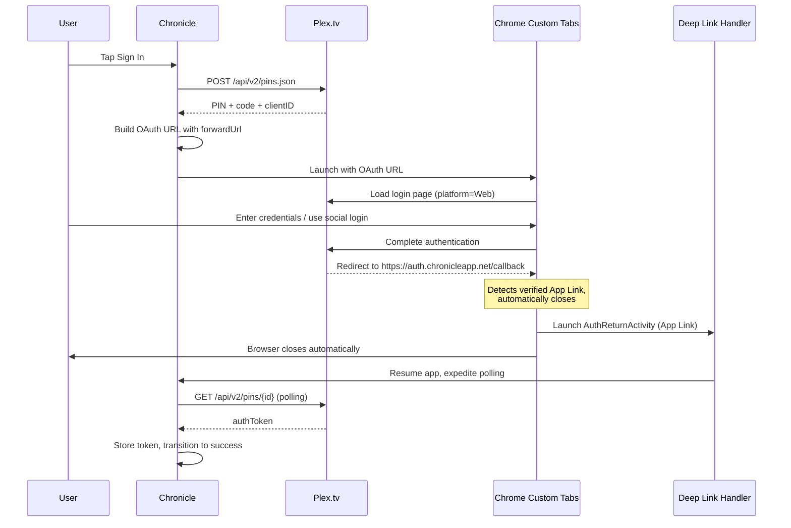
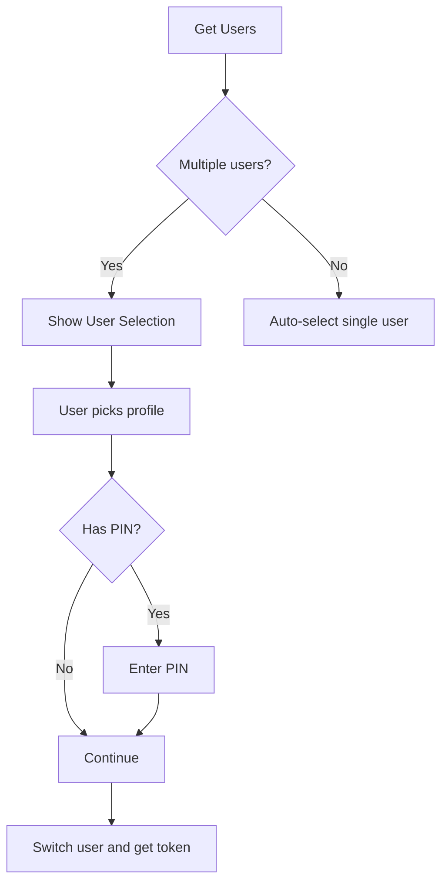
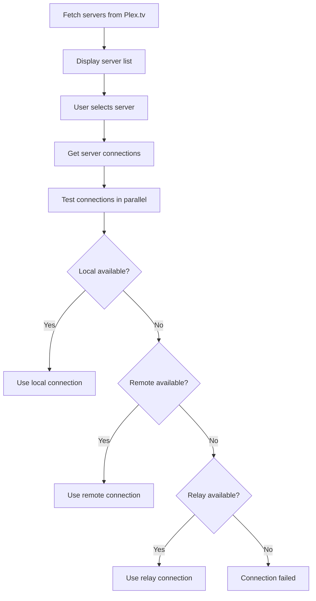

# Login & Authentication

This document covers Chronicle's authentication flow, including OAuth, user selection, server selection, and library selection.

## Plex Authentication

### OAuth Flow (Chrome Custom Tabs with Android App Links)

Chronicle uses Plex's OAuth 2.0 PIN-based authentication flow with **Chrome Custom Tabs** and **Android App Links** for secure, seamless browser authentication. The browser automatically closes when redirecting to Chronicle's verified App Link, providing a smooth OAuth experience.

**Key Technologies**:
- **Chrome Custom Tabs**: Native browser authentication (not WebView) for social login support
- **Android App Links**: HTTPS-based deep linking with domain verification for automatic browser dismissal
- **Digital Asset Links**: Domain ownership verification via `assetlinks.json`



**Key Implementation Details:**
- **Platform = "Web"**: Critical for enabling social login (Google, Facebook) which is blocked in WebViews
- **Chrome Custom Tabs**: Provides native browser security, password managers, and autofill
- **Android App Links**: `https://auth.chronicleapp.net/callback` verified via Digital Asset Links—causes automatic browser dismissal
- **Legacy Fallback**: `chronicle://auth/callback` custom URI scheme remains for edge cases where App Links fail
- **Polling with Timeout**: Checks for token every 1.5s, expedited to 200ms after callback, 2-minute timeout

### Key Files
- [`PlexAuthCoordinator`](../../app/src/main/java/local/oss/chronicle/features/auth/PlexAuthCoordinator.kt) - OAuth state machine coordinator
- [`PlexAuthUrlBuilder`](../../app/src/main/java/local/oss/chronicle/features/auth/PlexAuthUrlBuilder.kt) - Builds OAuth URL with proper encoding
- [`PlexAuthState`](../../app/src/main/java/local/oss/chronicle/features/auth/PlexAuthState.kt) - Immutable state representation
- [`AuthReturnActivity`](../../app/src/main/java/local/oss/chronicle/features/auth/AuthReturnActivity.kt) - App Link and deep link handler for auth callbacks
- [`AuthCoordinatorSingleton`](../../app/src/main/java/local/oss/chronicle/features/auth/AuthCoordinatorSingleton.kt) - Cross-component communication bridge
- [`LoginFragment`](../../app/src/main/java/local/oss/chronicle/features/login/LoginFragment.kt) - Login UI, launches Chrome Custom Tabs
- [`LoginViewModel`](../../app/src/main/java/local/oss/chronicle/features/login/LoginViewModel.kt) - OAuth state management
- [`PlexLoginRepo`](../../app/src/main/java/local/oss/chronicle/data/sources/plex/PlexLoginRepo.kt) - PIN creation and token polling
- [`PlexLoginService`](../../app/src/main/java/local/oss/chronicle/data/sources/plex/PlexService.kt) - Plex API endpoints
- [`pages/.well-known/assetlinks.json`](../../pages/.well-known/assetlinks.json) - Digital Asset Links file for domain verification
- [`pages/auth/callback/index.html`](../../pages/auth/callback/index.html) - Fallback page when App Links don't work (rare)

---

## Server/User Selection

### Multi-User Support

Plex accounts can have multiple users (managed users). Chronicle supports user switching:



**Implementation**: 
- [`ChooseUserFragment`](../../app/src/main/java/local/oss/chronicle/features/login/ChooseUserFragment.kt)
- [`ChooseUserViewModel`](../../app/src/main/java/local/oss/chronicle/features/login/ChooseUserViewModel.kt)

### Server Selection

Users can have multiple Plex servers. Chronicle tests connectivity and selects the best connection:



**Implementation**: 
- [`ChooseServerFragment`](../../app/src/main/java/local/oss/chronicle/features/login/ChooseServerFragment.kt)
- [`PlexConfig.setPotentialConnections()`](../../app/src/main/java/local/oss/chronicle/data/sources/plex/PlexConfig.kt)

### Library Selection

Lists Music libraries from the selected server (audiobooks are stored as music in Plex):

**Implementation**: 
- [`ChooseLibraryFragment`](../../app/src/main/java/local/oss/chronicle/features/login/ChooseLibraryFragment.kt)
- [`ChooseLibraryViewModel`](../../app/src/main/java/local/oss/chronicle/features/login/ChooseLibraryViewModel.kt)

---

## Android App Links Implementation

Chronicle uses **Android App Links** for OAuth callback to enable automatic Chrome Custom Tabs dismissal.

### Domain Verification

**Digital Asset Links File** at `https://auth.chronicleapp.net/.well-known/assetlinks.json`:

```json
[
  {
    "relation": ["delegate_permission/common.handle_all_urls"],
    "target": {
      "namespace": "android_app",
      "package_name": "local.oss.chronicle",
      "sha256_cert_fingerprints": ["SHA256:..."]
    }
  }
]
```

This file proves Chronicle owns the `auth.chronicleapp.net` domain. Android verifies this file at install time when `android:autoVerify="true"` is present in the intent filter.

### AndroidManifest Configuration

**Primary (App Link with auto-verification)**:
```xml
<intent-filter android:autoVerify="true">
    <action android:name="android.intent.action.VIEW" />
    <category android:name="android.intent.category.DEFAULT" />
    <category android:name="android.intent.category.BROWSABLE" />
    <data
        android:scheme="https"
        android:host="auth.chronicleapp.net"
        android:pathPrefix="/callback" />
</intent-filter>
```

**Fallback (Custom URI scheme)**:
```xml
<intent-filter>
    <action android:name="android.intent.action.VIEW" />
    <category android:name="android.intent.category.DEFAULT" />
    <category android:name="android.intent.category.BROWSABLE" />
    <data
        android:scheme="chronicle"
        android:host="auth"
        android:pathPrefix="/callback" />
</intent-filter>
```

### Why App Links Auto-Close Chrome Custom Tabs

When Chrome Custom Tabs navigates to `https://auth.chronicleapp.net/callback`:

1. **Android intercepts**: System recognizes verified App Link before browser renders
2. **Domain verification**: Checks Digital Asset Links file matches app signature
3. **App launch**: Launches [`AuthReturnActivity`](../../app/src/main/java/local/oss/chronicle/features/auth/AuthReturnActivity.kt)
4. **Auto-close**: Chrome Custom Tabs automatically closes since navigation was handled by app
5. **Seamless return**: User sees Chronicle immediately without manual browser dismissal

**This does NOT work with custom URI schemes** (`chronicle://`) which leave Chrome Custom Tabs in the foreground, requiring manual close.

---

## Related Documentation

- [Plex OAuth Auto-Close Implementation](../PLEX_LOGIN_AUTO_CLOSE.md) - Detailed Chrome Custom Tabs and App Links architecture
- [Features Index](../FEATURES.md) - Overview of all features
- [API Flows](../API_FLOWS.md) - Detailed API documentation
- [OAuth Flow Examples](../example-query-responses/oauth-flow.md) - Real OAuth API responses
- [Managed Users](../example-query-responses/managed_users.md) - Managed user account examples
