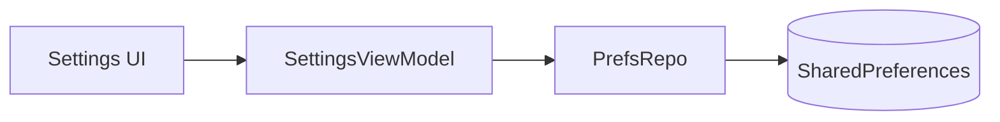
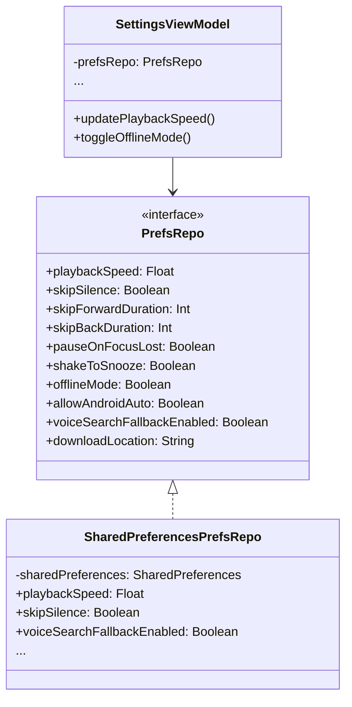

# Settings

This document covers Chronicle's configurable preferences and settings.

## Overview

Chronicle provides various settings to customize the listening experience.

---

## Available Settings

| Setting | Description | Default |
|---------|-------------|---------|
| **Playback Speed** | Default playback speed (0.5x - 3.0x) | 1.0x |
| **Skip Silence** | Automatically skip quiet parts of audio | Off |
| **Skip Forward Duration** | Jump forward duration (10-90 seconds) | 30s |
| **Skip Back Duration** | Jump back duration (10-90 seconds) | 10s |
| **Pause on Focus Lost** | Pause when other audio plays | On |
| **Shake to Snooze** | Extend sleep timer by shaking device | On |
| **Offline Mode** | Show only downloaded content | Off |
| **Allow Android Auto** | Enable Android Auto support | Off |
| **Resume on failed voice search** | Fallback to recent book when voice search finds nothing | On |
| **Download Location** | Choose storage location for downloads | Internal |

---

## Implementation

### Key Files

| File | Purpose |
|------|---------|
| [`SettingsFragment`](../../app/src/main/java/local/oss/chronicle/features/settings/SettingsFragment.kt) | Settings UI |
| [`SettingsViewModel`](../../app/src/main/java/local/oss/chronicle/features/settings/SettingsViewModel.kt) | Settings state management |
| [`PrefsRepo`](../../app/src/main/java/local/oss/chronicle/data/local/SharedPreferencesPrefsRepo.kt) | Preferences persistence |

### Preference Storage

Settings are stored using Android's SharedPreferences:

---

## Setting Categories

### Playback Settings

Control how audio is played:

- **Playback Speed**: Adjusts narration speed
- **Skip Silence**: Uses ExoPlayer's silence skipping feature
- **Skip Durations**: Configures forward/back jump amounts
- **Pause on Focus Lost**: Handles audio focus changes

### Offline Settings

Control offline behavior:

- **Offline Mode**: When enabled, only downloaded books appear
- **Download Location**: Internal storage or SD card (if available)

### Android Auto Settings

Control Android Auto behavior:

- **Allow Android Auto**: Toggle for in-car playback support
- **Resume on failed voice search**: Controls fallback behavior when voice search finds no results

**Resume on Failed Voice Search Details:**

| Setting | Key | Default |
|---------|-----|---------|
| Resume on failed voice search | `key_voice_search_fallback_enabled` | `true` (enabled) |

When **enabled**, if a voice search in Android Auto returns no results (e.g., user says "play something" or searches for a non-existent book), Chronicle will:
1. Try to resume the most recently played audiobook
2. If no recent history, play the first book in the library
3. Only show an error if the library is empty

When **disabled**, voice searches that return no results will always show an error message.

**Use Case Examples:**

| Scenario | Fallback ON | Fallback OFF |
|----------|-------------|--------------|
| "Play something" with recent book | ✓ Resumes recent book | ✓ Resumes recent book |
| "Play [nonexistent book]" with recent book | ✓ Resumes recent book | ✗ Shows error |
| "Play something" with no history | ✓ Plays first book | ✓ Plays first book |
| "Play [nonexistent book]" with no history | ✓ Plays first book | ✗ Shows error |
| Empty library | ✗ Shows error | ✗ Shows error |

**Implementation:**
- Storage: [`SharedPreferencesPrefsRepo.voiceSearchFallbackEnabled`](../../app/src/main/java/local/oss/chronicle/data/local/SharedPreferencesPrefsRepo.kt)
- Usage: [`AudiobookMediaSessionCallback.handleSearchSuspend()`](../../app/src/main/java/local/oss/chronicle/features/player/AudiobookMediaSessionCallback.kt)

### Other Platform Settings

- **Shake to Snooze**: Accelerometer-based sleep timer extension

---

## Settings Architecture

---

## Related Documentation

- [Features Index](../FEATURES.md) - Overview of all features
- [Playback](playback.md) - How playback settings are applied
- [Downloads](downloads.md) - Download location configuration
- [Android Auto](android-auto.md) - Android Auto setting details
